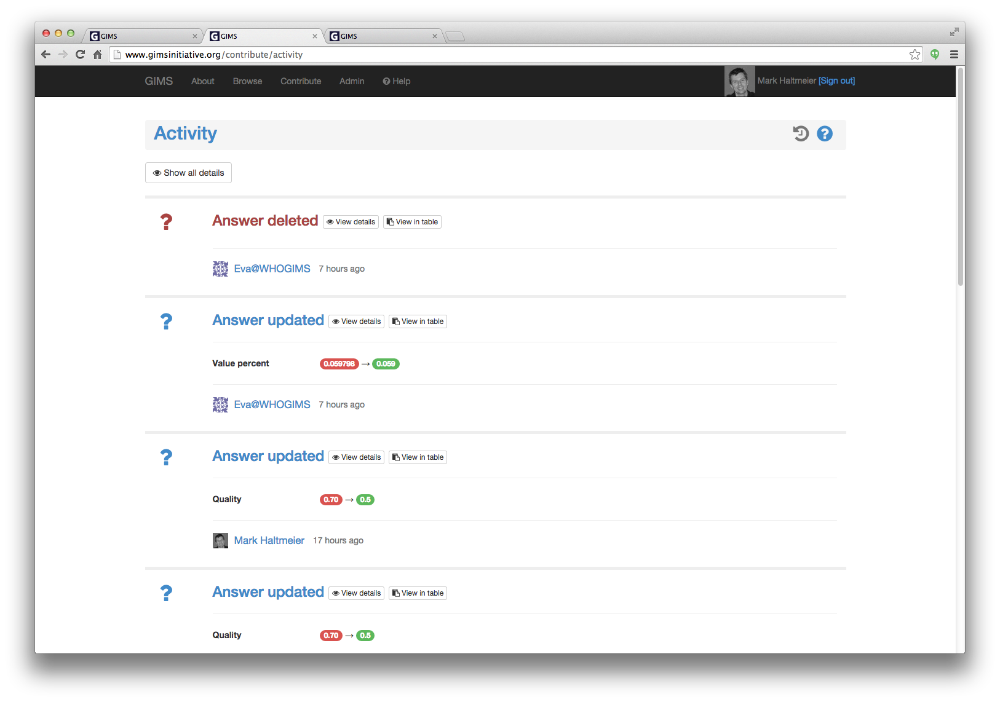
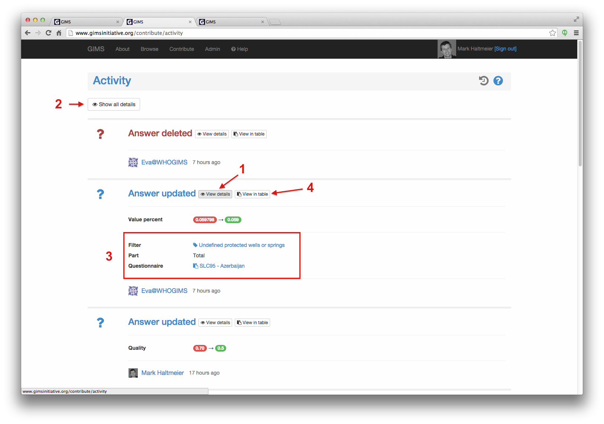

Activity
========

The activity page enables users to see all modifications performed within GIMS in reverse chronology.

To view details about a specific action, click on the :guilabel:`View details` button [1]. If you wish to see details for all modifications, click on the :guilabel:`Show all details` button [2].

The detailed view shows at what level the modification has been made [3]. If you wish to revert back to the original situation, click on the :guilabel:`View in table` button [4] and perform the update manually.

.. note::

    Need further help? Send an email to who@gimsinitiative.org