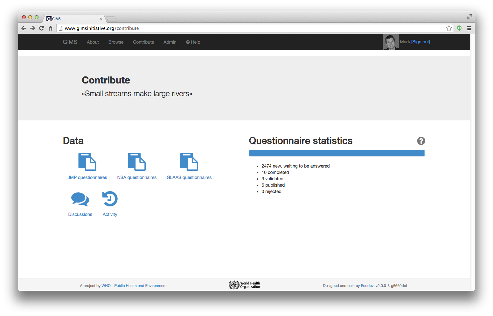

Basic notions
=============

GIMS has two main sections:

* **Browse** enables you to visualize in the form of tables, graphs and maps all validated data that the authors agree to make public. No login is required.

.. image:: img/browse.png
    :width: 100%
    :alt: Browse

* **Contribute** requires that you :ref:`sign-in`. You can then provide an input to the data to which you are entitled (see the access rights section). You can also conduct your own survey and decide to keep the data private if you wish…

.. _sign-in:

Register or Sign in
-------------------

If you have no user account yet, fill in the fields in the "Register" column.

If you already have a user account, sign in.

