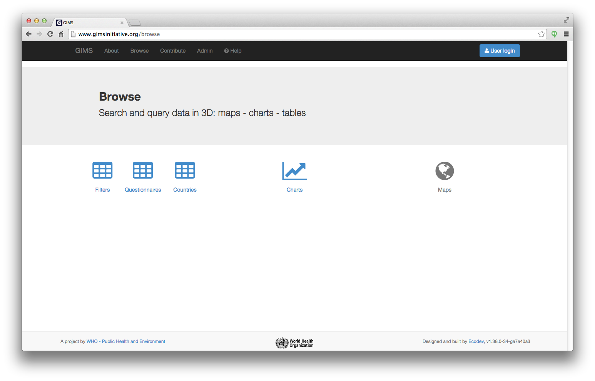

Basic notions
=============

GIMS has three main sections:

* **Browse** enables you to visualize in the form of tables, graphs and maps
  (available soon) all validated data that the authors agree to make public. No
  login is required.

* **Contribute** requires that you :ref:`sign-in`. You can then provide an
  input for the :ref:`questionnaires` that are made available to you.

.. image:: img/contribute.png
    :width: 100%
    :alt: Contribute section

* **Admin** requires that you :ref:`sign-in`. From here, you can conduct your
  own :ref:`survey` and decide to keep the data private if you wish… This
  is also the starting point to manage users as well as filters, filter-sets
  and rules.

.. image:: img/administration.png
    :width: 100%
    :alt: Admin section

* **Help** is the link to the documentation you are reading. On most pages you will find question marks that provide an initial reminder of what you can do where you are as well as a contextual link to a specific section of the documentation.

.. _sign-in:

Register or Sign in
-------------------

If you have no user account yet, fill in the fields in the "Register" column
[1]. You will be able to complete your :doc:`users account <users>` in a
second stage.

If you already have a user account, simply sign in with your email and password
[2].

.. image:: img/register_signin.png
    :width: 100%
    :alt: Register or sign in

.. warning::

    GIMS is still being built: error messages may appear [1] (thanks to
    report them to who@gimsinitiative.org). It is also normal that the system
    takes time to display certain sets of information (please wait until
    the arrows [2] stop turning), all data being currently recalculated at
    each stage. Optimization via the implementation of different levels of
    cache will be carried out progressively. Thank you for your patience
    and understanding :-)

.. image:: img/ongoing_process.png
    :width: 100%
    :alt: GIMS error messages and data display
