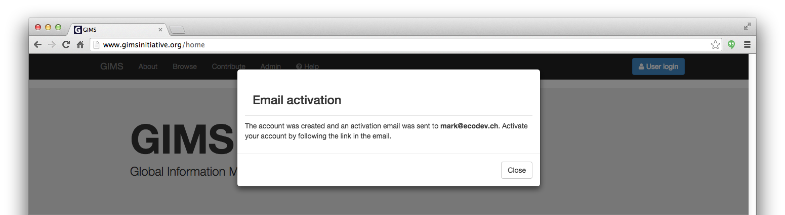
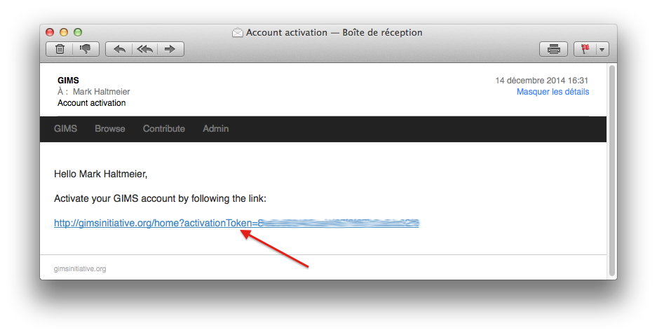
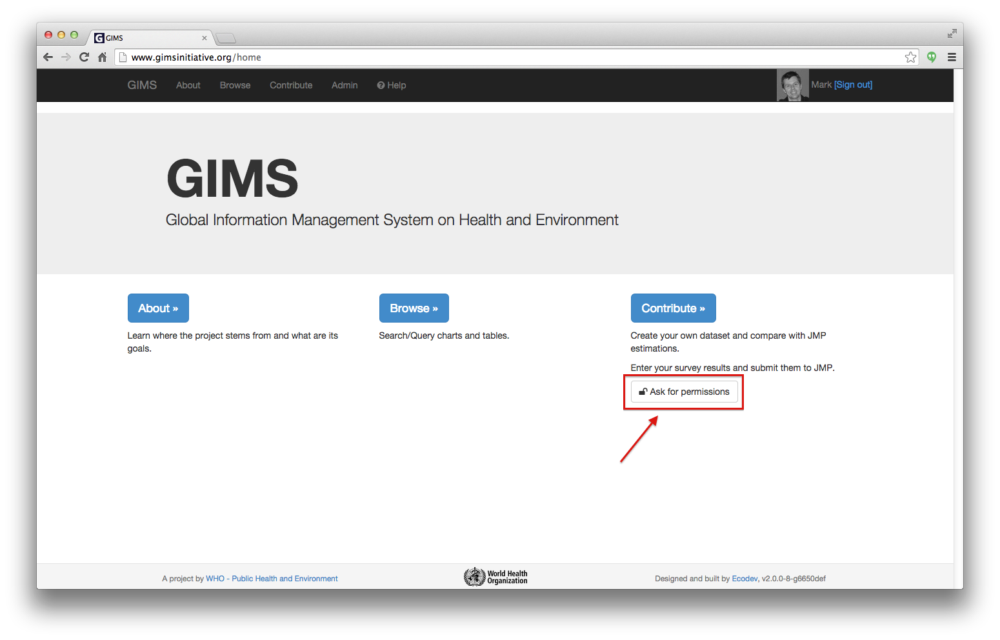

Basic notions
=============

GIMS has three main sections on top of the **"About"** page and the **"Help"** section:

* **Browse** enables you to visualize in the form of tables, graphs and maps
  (available soon) all validated data that the authors agree to make public. No
  login is required.

.. image:: img/browse.png
    :width: 100%
    :alt: Browse section

* **Contribute** requires that you :ref:`sign-in`. You can then provide an
  input for the :ref:`questionnaires<DI questionnaires>` that are made available to you.

.. image:: img/contribute.png
    :width: 100%
    :alt: Contribute section

* **Admin** requires that you :ref:`sign-in`. From here, you can conduct your
  own :ref:`survey <DI survey>` and decide to keep the data private if you wish… This is also the starting point to manage a :term:`user` as well as a :term:`filter`, :term:`filter set` or a :term:`rule`.

.. image:: img/administration.png
    :width: 100%
    :alt: Admin section

* **Help** provides a direct link to the documentation you are reading. Looking for something specific? Use the "Search docs" field [1]… If you wish to download the documentation as a PDF, click on the "Read the Docs" bar at the bottom [2] and choose "PDF" [3].

.. image:: img/help.png
    :width: 100%
    :alt: help section

On most pages you will find question marks [1] that provide an initial reminder of what you can do where you are as well as a contextual link to a specific section of the documentation [2].

.. _sign-in:

Register or Sign in
-------------------

If you already have a user account, simply **sign in** with your email and password [2].

If you have no user account yet, fill in all the fields in the **Register** column [1] and click on the blue "Register" button.

.. image:: img/register_signin.png
    :width: 100%
    :alt: Register or sign in

You will then get the following notice. Click on "Close" and go to your email.
 

Your GIMS account will only be active once you will have clicked on the link in the email that has been sent to you automatically. This process also enables you to login directly.

.. note::

    You will be able to complete your :doc:`users account <user>` in a second stage.

.. _ask-permissions:

Ask for permissions
-------------------

Once you have a user account, you can request to obtain the permission to access certain sets of data. To do so, simply click on the "Ask for permissions" button on the GIMS home page.

In the page that follows, define the country(ies), the role(s) and the survey type (JMP or GLAAS) you would like to access… and click on the "Send roles request" button.

.. image:: img/ask-permissions2.png
    :width: 100%
    :alt: Ask for permissions details

This will send an automatic email to the owner(s) of the corresponding data who will then decide if they will grant you the access… or not.

.. note::

    For details about how to grant access to data as an owner, see the :doc:`users <user>` page.

.. warning::

    GIMS is still being built: error messages may appear [1] (thanks to
    report them to who@gimsinitiative.org). It is also normal that the system
    takes time to display certain sets of information (please wait until
    the arrows [2] stop turning). Further optimizations will be carried out
    progressively. Thank you for your patience and understanding :-)

