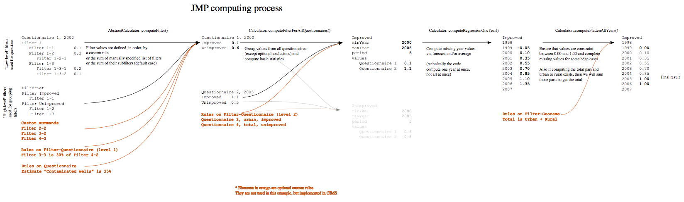

Computing
=========

.. note::

    This section details the computing process that has been setup specifically for JMP data.

Computing is a complex process that can be split in 4 steps as described below:

#. :ref:`Compute all filters for one questionnaire <step1>`
#. :ref:`Compute all questionnaires <step2>`
#. :ref:`Compute all years <step3>`
#. :ref:`Fine tune the final result <step4>`

.. _my-computing-image:

While the default computing process should satisfy the majority of cases, the
user can choose to customize it in three of the above steps via rules or summands (shown in orange on the illustration).

.. _step1:

Step 1 - Completing filter values
---------------------------------

The first computation step is to complete filter values, as much as possible,
based on the values entered by the user for other filters. Example: if the user entered data for ``House connections`` and ``Public tap``, we are able to sum those values to get a computed value for the parent filter ``Tap water``.

There are three distinct ways to compute a value for a filter. The first
available option will be used, and the rest will be discarded:

#. A custom :term:`rule` defined by the user
#. A custom list of :term:`summands<summand>` to be summed
#. The natural children of the filter to be summed

The last case is by far the most common one. It means a parent filter is the sum
of its children. This is used for the vast majority of filters and nothing
special needs to be done, except build the correct filter hierarchy once and
for all.

The two other possibilities are the first way to customize GIMS computation. A
simple customization for a filter **across all questionnaires** can be done via
summands. This is typically useful to create filters that act as a summary
of other transversal filters, rather than the standard hierarchical behavior.

And finally, rules allow the user to create very specific formulas for **a specific questionnaire only**. Or share a rule for a few specific questionnaires only.

The result of this computation step is the equivalent of the *Tables_W* and *Tables_S* sheets in the former Excel country files. In GIMS, it can be viewed via :menuselection:`Browse --> Filters (table)`.

.. _step2:

Step 2 - Computing questionnaire values
----------------------------------------

The second step uses the previous results from all questionnaires and computes
some statistics. These statistics are for internal use only and are not available to end-users.

At this stage, the user can use step 2 rules that enable him to **ignore values**. While some values were interesting in the previous step, we can decide that we are no longer interested in them for this and following computing steps.

Rules of step 2 are also the first opportunity to say ``Total = Urban + Rural``.
If in the previous step, JMP wanted to keep the raw numbers for ``Total``, from now on ``Total`` will be computed differently.

The result of this computation step is the equivalent of the *GraphData_W* and *GraphData_S* sheets in the former Excel country files. In GIMS, it can be viewed via :menuselection:`Browse --> Questionnaires (table)`, and can also be seen as the data points on the charts via :menuselection:`Browse --> Charts`.

.. _step3:

Step 3 - Computing the regression
---------------------------------

So far we computed values on a per filter and then per questionnaire basis. But
the final goal is to compute data on a **per year** basis. This is done in the third step, via a regression.

According to the statistics from previous steps, we will use the Excel function
``AVERAGE()`` if we don't have much data, or ``FORECAST()`` if we have enough
significant information. More details about edge cases are available in GIMS
`source code <https://github.com/Ecodev/gims/blob/master/module/Application/src/Application/Service/Calculator/Calculator.php#L231>`__.

The result of this computation step is the equivalent of the tables on the right
of the *Estimates* sheet in the former Excel country files. In GIMS, it is not available, since it is only an intermediary result.

.. _step4:

Step 4 - Flattening the regression
----------------------------------

The last step aims at *standardizing* the regression. First of all, we will constrain all values between 0% and 100% (internally 0.00 and 1.00), then we will try to project the trend both in the past and in the future, depending on the data available. This is what causes the horizontal parts of the trend lines in the charts. See the `source code <https://github.com/Ecodev/gims/blob/master/module/Application/src/Application/Service/Calculator/Calculator.php#L126>`__ for further details.

This is also the last opportunity to use rules to customize results. In this
case, the rules are applied **per country**. They can be used to say, again,
``Total = Urban + Rural``. Or they can be used to do complementary computations
such as ``Other Improved = Total improved - Piped onto premises``.

The final result of this computation step is the equivalent of the tables on the
left of the *Estimates* sheet in the former Excel country files. In GIMS, it can be viewed via :menuselection:`Browse --> Countries (table)`, or as the trend lines on the charts via :menuselection:`Browse --> Charts`.

.. note::

    In this section we mentioned two kinds of application for rules: for filters
    (step 1 and 2) and for countries. There is a third kind, for questionnaires,
    that may be useful. See the :doc:`full explanation<rule>`.
