How to gather data?
===================

To gather data, the normal process requires 3 initial basic steps:

#. create a :ref:`DI survey`
#. create the :ref:`DI questions`
#. dispatch the survey as :ref:`DI questionnaires`

Once this first step is completed, see how to ensure each :doc:`questionnaire
<data_input2>` is filled in properly.

Since all data is linked to one or several people, you must first of all
:ref:`sign-in`.

.. _DI survey:

Survey
-------
You can now go to the **Admin** section and click on the **Surveys** icon.

.. image:: img/administration.png
    :width: 100%
    :alt: Administration section

Surveys you can access are listed. If there are many, you can find a specific survey by using the search field [1]. To edit it, click on the pencil icon [2].

To create a new survey, click on the corresponding button [3].

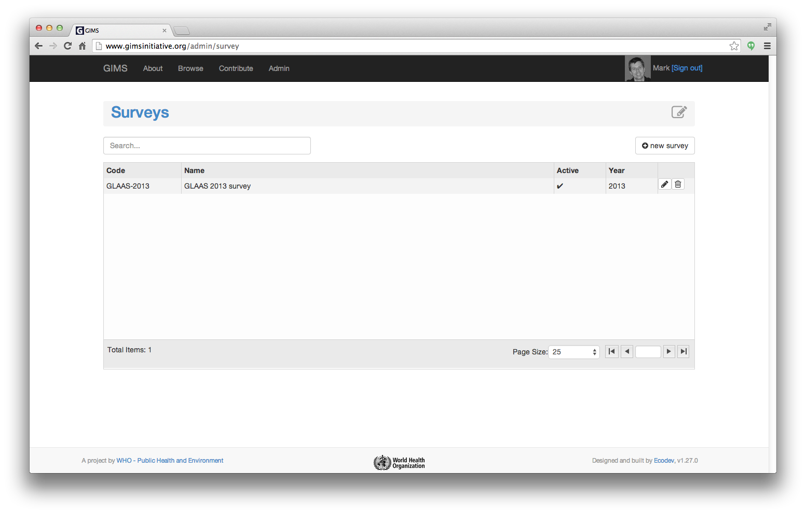

For each survey, there are 4 tabs:

* **General**: in this tab you must enter a *unique* and *meaningful* code
  (typically an acronyme of the type of survey + year); the name (a more
  detailed and explicit title of the survey); if it is active or not ("Yes"
  is mandatory for people to fill in questionnaires); the year it covers;
  internal comments as well as a start and end date (that define the timeframe
  in which data will be gathered/entered).

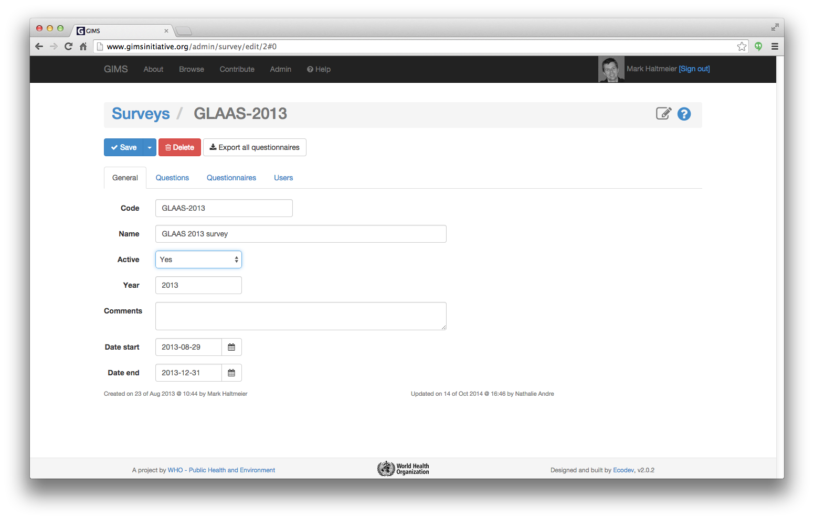

* **Questions**: in this tab you will see the already existing questions
  and how they are structured; be able to edit (pencil icon) or delete them
  (dustbin icon) as well as add a new question (click on the corresponding
  button). For further details about the different types of questions see the
  :ref:`DI questions` section below.

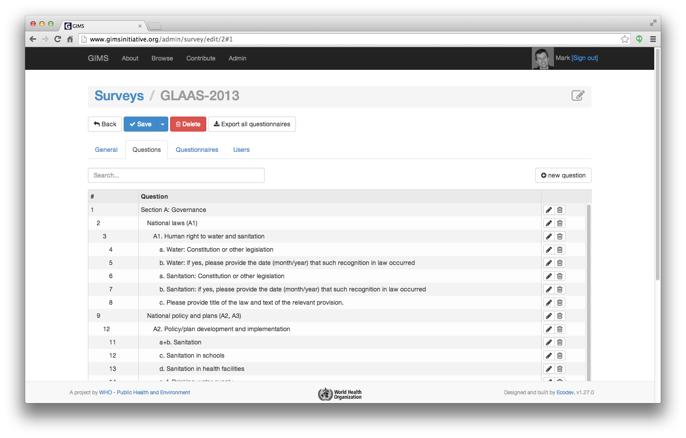

* **Questionnaires**: in this tab you will see the questionnaire(s) you are
  entitled to edit and/or validate. In this view you can see which spatial
  zone (country, city…) the questionnaire corresponds to; when it has
  been last modified and too what extent it has been completed. To add a new
  questionnaire click on the corresponding button. For further details about
  the questionnaires see the :ref:`DI questionnaires` section below.

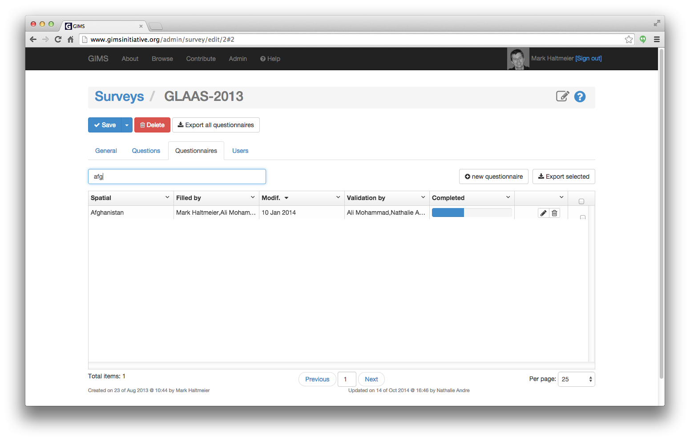

* **Users**: in this tab you will see the users that are entitled to
  edit and/or validate the survey and its questions as well as the linked
  questionnaires.

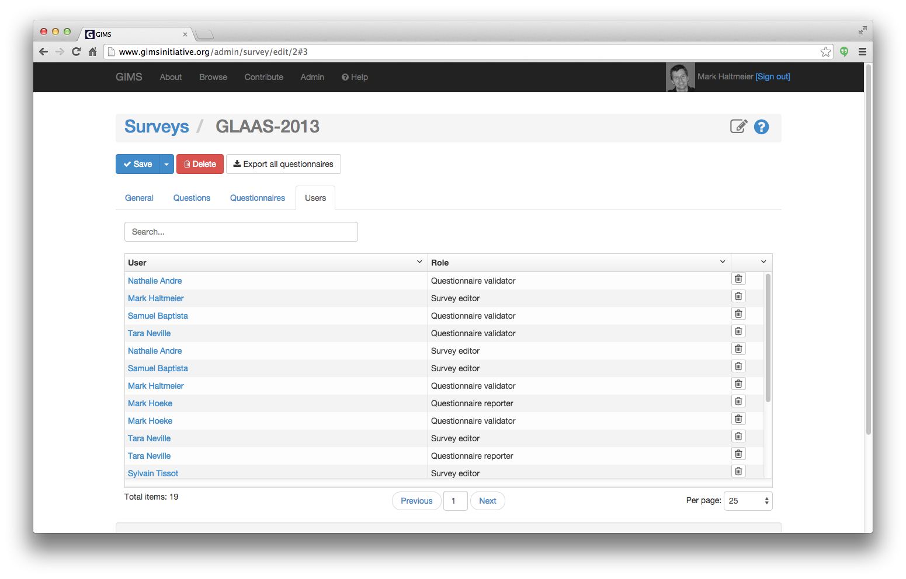

.. _DI questions:

Questions
---------

To enable you to gather both *quantitative* and *qualitative* information,
4 types of questions are at your disposal:

#. :ref:`choice`
#. :ref:`numeric`
#. :ref:`text`
#. :ref:`user`

The type **Chapter** helps you to create the survey structure with the
necessary introductory information for each (sub)chapter.

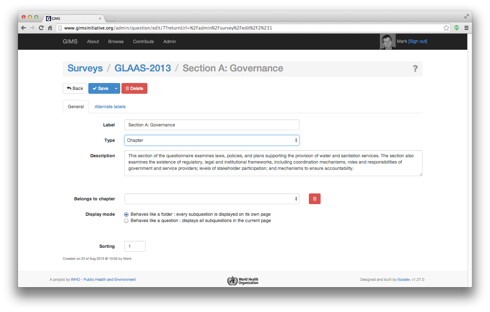

The fields "belongs to chapter" and "display mode" (screen copy above)
enable you to nest and group questions in an easy to understand structure
for the person who will fill in the questionnaire (screen copy below)…

.. image:: img/questionnaire_sample.png
    :width: 100%
    :alt: Questionnaire interface sample

Each question can be linked to a :term:`filter` and one or several zone(s)
/ :term:`part(s)<part>`.

The "Alternate labels" tab enables you to enter equivalent labels that
may have been used, such as translations of the term in other languages
(ex. "House connections" = "Robinet dans logement"…).

.. _choice:

Choice
^^^^^^

Choice questions can be either **single** (= radio button) or **multiple**
(= check-box) and can have as many choices as you wish: two choices is
equivalent to a boolean; three or more to a graduated evaluation…

For each choice an equivalent **value in percentage** (in fact a value between
0 and 1) can be chosen. This will prove useful when calculating the average
for a set of questionnaires covering a specific region…

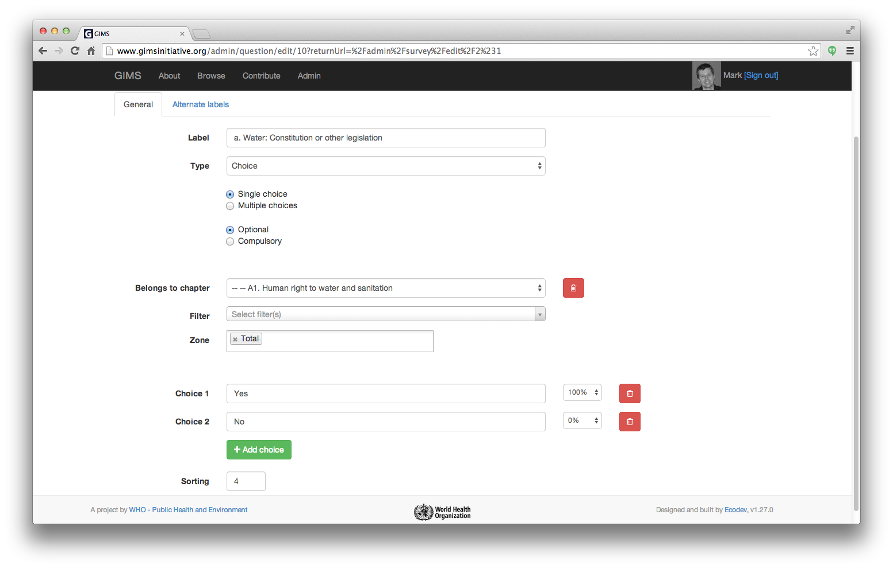

.. _numeric:

Numeric
^^^^^^^

Numeric questions can be either expressed as a **percentage** or an
**absolute** value.

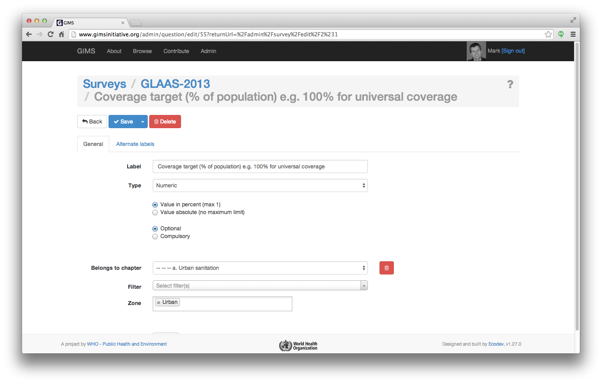

.. note::

    JMP questions have an extra check-box that enables to specify if the
    numeric value represents population data or not.

.. _text:

Text
^^^^

Text questions enable to gather qualitative data than provides important
additional information.

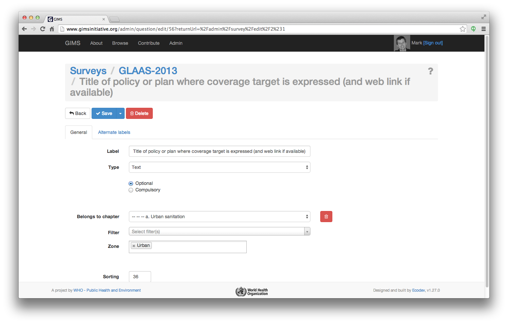

.. _user:

User
^^^^

User questions enable to gather names and contact information of people
straight into GIMS and if they already exist in the system, simply link to
their record.

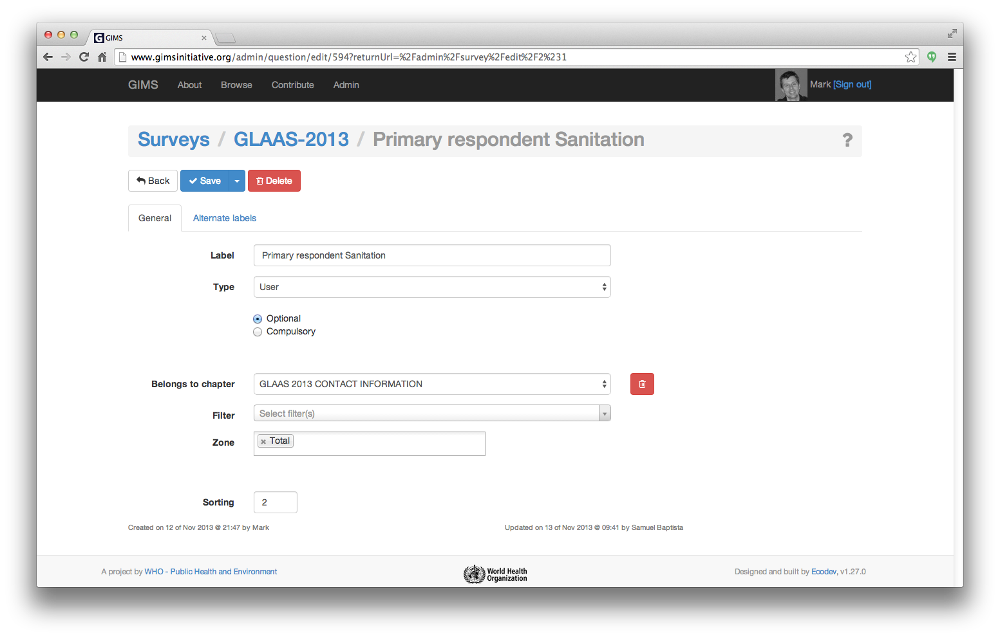

.. _DI questionnaires:

Questionnaires
--------------

A questionnaire contains the answers to a survey for a specific spatial entity
(country, city…) for a given time span (year, month…).

The two main tabs are:

General
^^^^^^^

The status indicates if the questionnaire is being answered (*New*), has
been *completed*, validated, *published* (a published questionnaire is
publicly available to anyone in the Browse section of GIMS) or eventually
*rejected*. See here for further information about the :doc:`validation
process <data_validation>`.

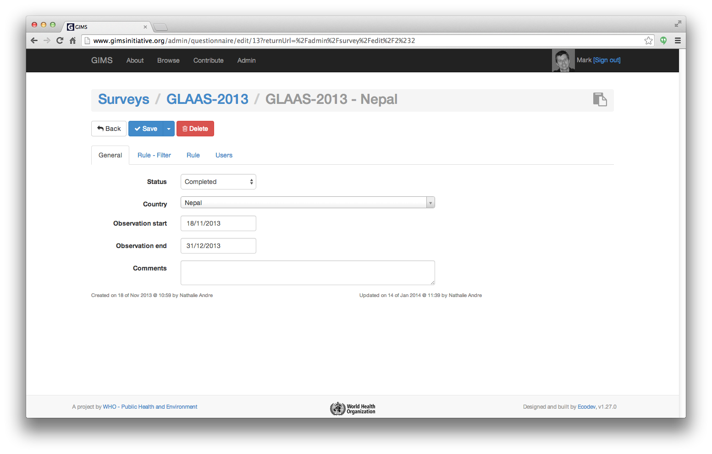

.. _DI questionnaires users:

Users
^^^^^

As in the survey, the users tab enables to define who can do what for the
current questionnaire. The user account must therefore exist.

You can either create it for him and provide him with his username and
password or ask him to create an account and then give him the access rights.

To add a new user, select the person [1] and define his role [2].

.. image:: img/questionnaire_users.png
    :width: 100%
    :alt: Questionnaires users tab

**Rule - Filter** and **Rule** tabs are only used when specific calculations
are linked to the questionnaire which is typically the case for JMP data. See
the :doc:`Rule section <rule>`.
