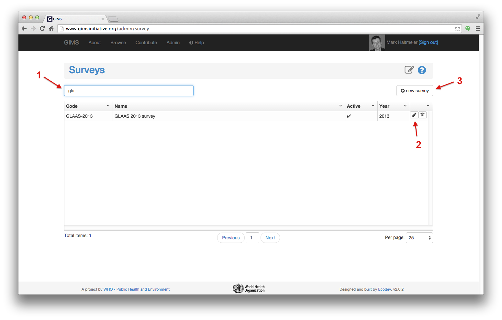
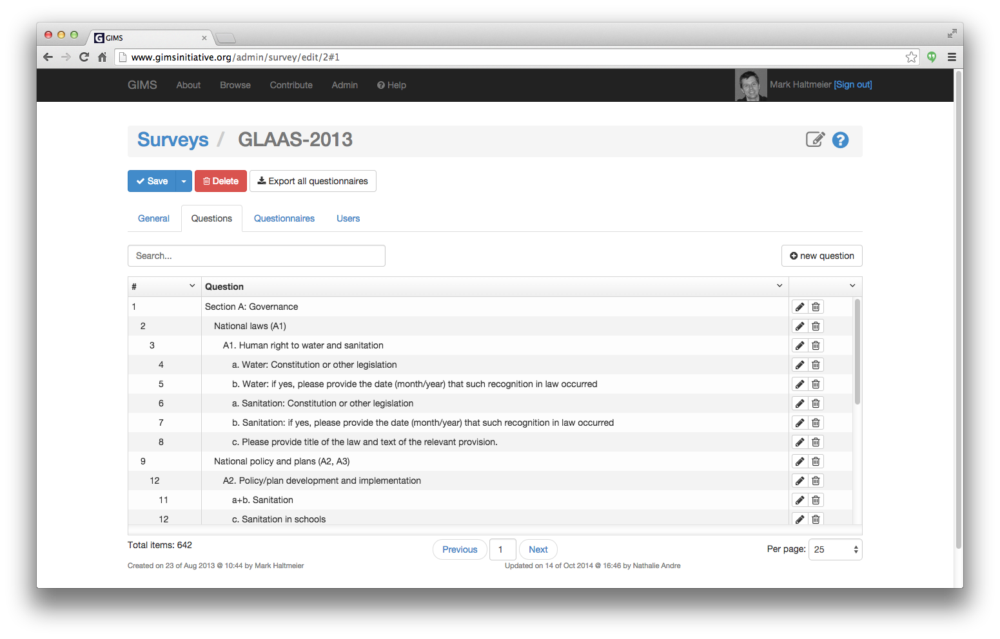
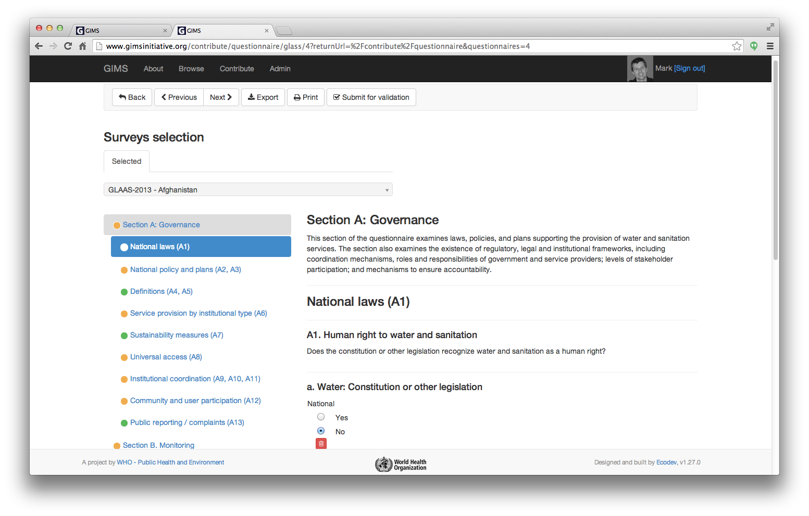
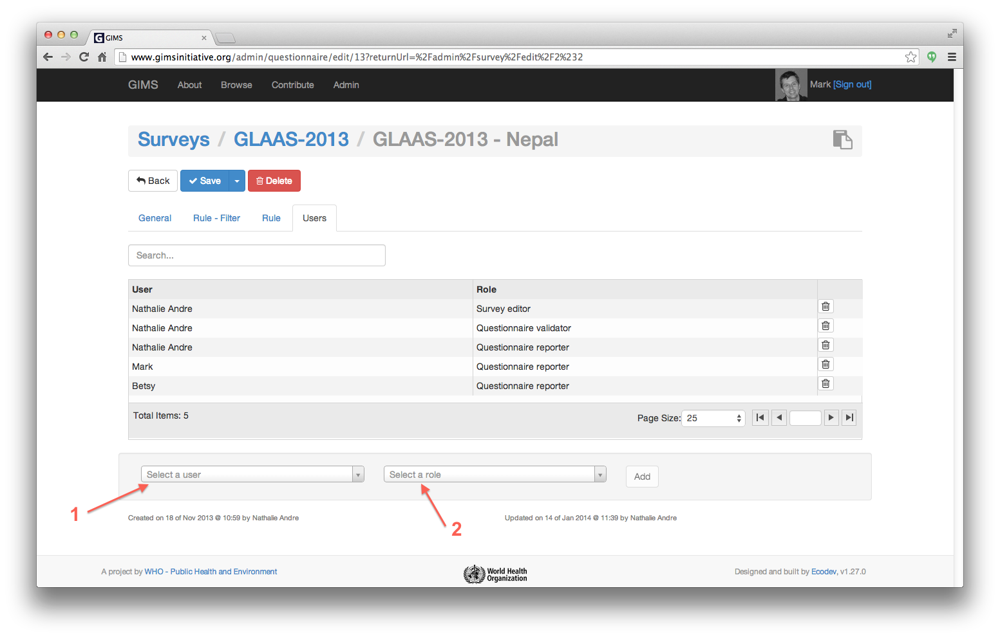

Data gathering and validation
=============================

To gather data, 3 basic steps are required:

#. create a :ref:`survey`
#. create the :ref:`questions`
#. dispatch the survey as :ref:`questionnaires`

Since all data is linked to one or several people, you must first of all that you :ref:`sign-in`.

.. _survey:

Survey
-------
You can now go to the **Admin** section and click on the **Surveys** icon.

.. image:: img/administration.png
    :width: 100%
    :alt: Administration section

If you have access to an existing survey, it will be listed. To edit it, click on the pencil icon.

To create a new survey, click on the corresponding button.

For each survey, there are 4 tabs:

* **General**: in this tab you must enter a unique code (typically an acronyme of the type of survey + year); the name (a more detailed and explicit title of the survey); if it is active or not (Yes is mandatory for people to fill in questionnaires); the year it covers; internal comments as well as a start and end date (that define the timeframe in which data will be gathered/entered).

* **Questions**: in this tab you will see the already existing questions and how they are structured; be able to edit (pencil icon) or delete them (dustbin icon) as well as add a new question (click on the corresponding button). For further details about the different types of questions see the :ref:`questions` section below.

* **Questionnaires**: in this tab you will see the questionnaire(s) you are entitled to edit and/or validate. In this view you can see which spatial zone (country, city…) the questionnaire corresponds to, when it has been last modified and too what extent it has been completed. To add a new questionnaire click on the corresponding button. For further details about the questionnaires see the :ref:`questionnaires` section below.

* **Users**: in this tab you will see the users that are entitled to edit and/or validate the survey and its questions as well as the linked questionnaires.

.. _questions:

Questions
---------

To enable you to gather both *quantitative* and *qualitative* information, 4 types of questions are at your disposal:

#. :ref:`choice`
#. :ref:`numeric`
#. :ref:`text`
#. :ref:`user`

The type **Chapter** helps you to create the survey structure with the necessary introductory information.

The fields "belongs to chapter" and "display mode" (screen copy above) enable you to nest and group questions in an easy to understand structure for the person who will fill in the questionnaire (screen copy below)…

Each question can be linked to a :term:`filter` and a zone (or :term:`part`).

.. _choice:

Choice
^^^^^^

Choice questions can be either **single** (= radio button) or **multiple** (= check-box) and can have as many choices as you wish: two choices is equivalent to a boolean; three or more to a graduated evaluation…

For each choice an equivalent **value in percentage** (in fact a value between 0 and 1) can be chosen. This will prove useful when calculating the average for a set of questionnaires covering a specific region…

.. _numeric:

Numeric
^^^^^^^

Numeric questions can be either expressed as a **percentage** or an **absolute** value.

.. _text:

Text
^^^^

Text questions enable to gather qualitative data than provides important additional information.

.. _user:

User
^^^^

User questions enable to gather names and contact information of people straight into GIMS and if they already exist in the system, simply link to their record.

.. _questionnaires:

Questionnaires
--------------

A questionnaire contains the answers to a survey for a specific spatial entity (country, city…) for a given time span (year, month…).

The two main tabs are:

* **General**: The status indicates if the questionnaire is being answered (*New*), has been *completed*, validated, *published* (a published questionnaire is publicly available to anyone in the Browse section of GIMS) or eventually *rejected*.

.. image:: img/questionnaire_general.png
    :width: 100%
    :alt: Questionnaires general tab

* **Users**: As in the survey, the users tab enables to define who can do what for the current questionnaire. To add a new user, select the person and define his role.

**Rule - Filter** and **Rule** tabs are only used when specific calculations are linked to the questionnaire which is the case for JMP data. See the :doc:`Rule section <rule>`