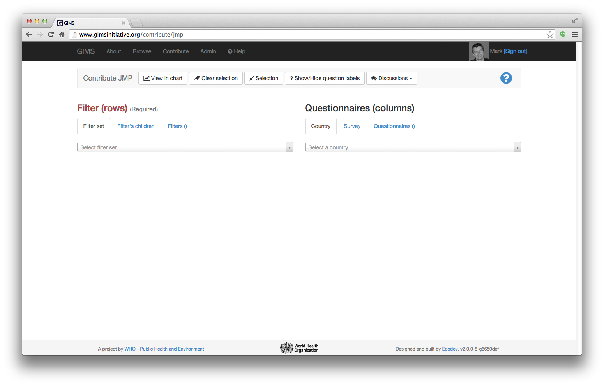
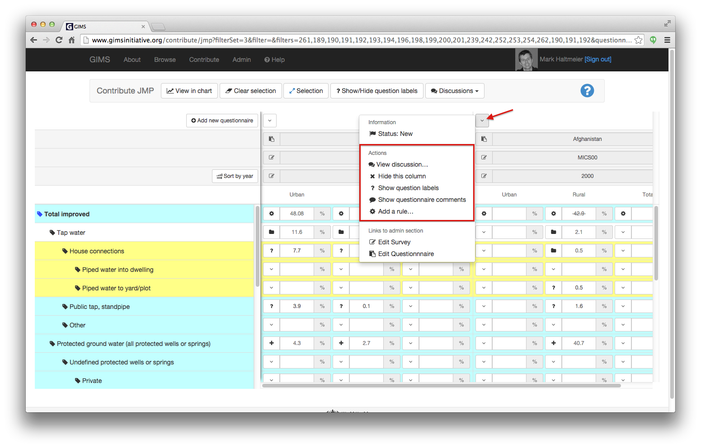
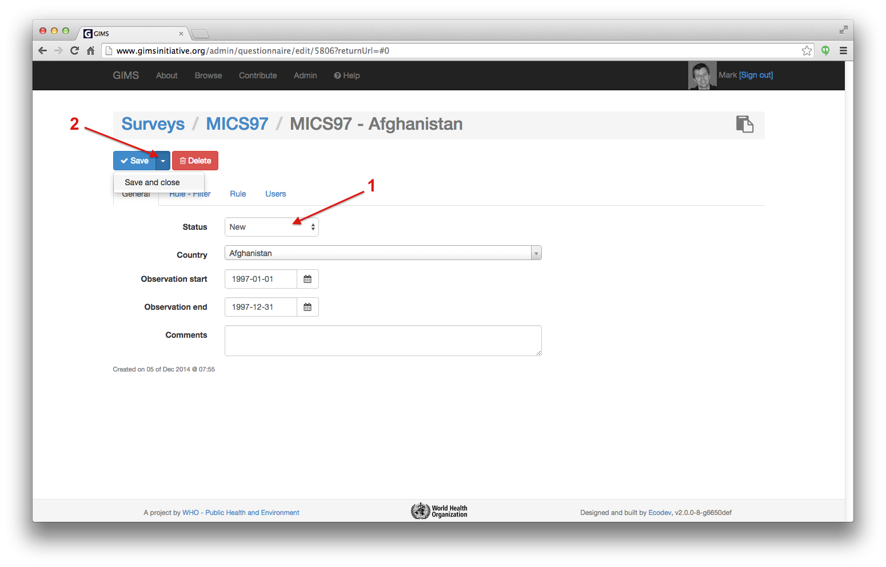
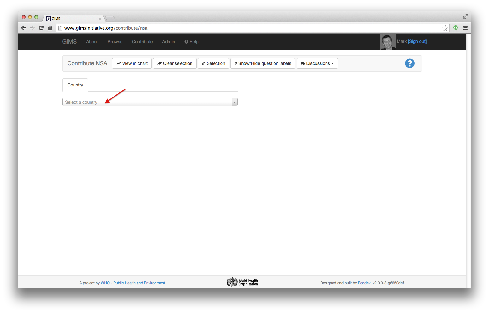
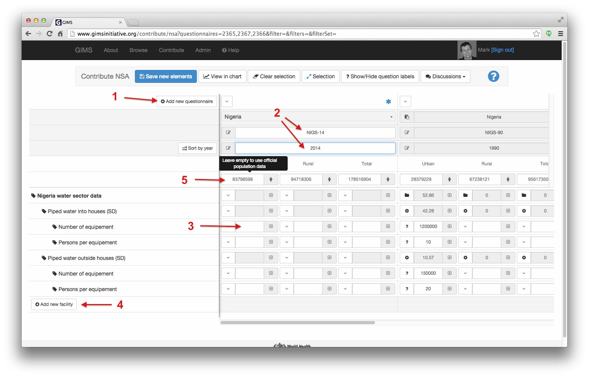
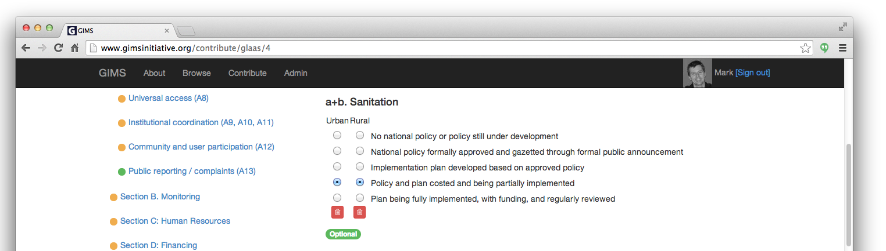

How to answer a questionnaire?
==============================

To be able to enter data into a questionnaire you must have the necessary
access rights.

* If you already have a user account, simply sign in.

* If you don't have a user account yet, create one (see :ref:`sign-in`)
  and :ref:`ask-permissions` or if you know the author of the survey, he can
  grant you the access rights directly (see :ref:`DI questionnaires users`).

Once you have signed in, go to the "Contribute" section.

.. image:: img/contribute.png
    :width: 100%
    :alt: Contribute section

On this page 3 specialized data entries are available:

#. :ref:`DI JMP` (WHO and UNICEF as well as National Statistics Offices)
#. :ref:`DI NSA` (National Sector Agency)
#. :ref:`DI GLAAS` (WHO)

.. _DI JMP:

JMP questionnaires
------------------

Once you have clicked on the :guilabel:`JMP questionnaires` button you will be
directed to an interface that enables you to manage both *existing* data as well
as *new info*.

The typical flow will be to: 1) choose in the "Filter (rows) the **filter set** you need
(ex. "water: use of improved sources (JMP data)) and 2) select your **country** in the "Questionnaires
(columns). The resulting table looks
very close to the former Excel country files.

.. note::

    The Questionnaires and Filter selection menus are automatically hidden
    once the table view is generated. To access these menus again, simply
    click on the :guilabel:`Selection` button at the top.

.. image:: img/contribute_jmp2.png
    :width: 100%
    :alt: Display JMP questionnaires of a country

.. note::

    This interface also enables you to select a Survey [1] and get the
    corresponding questionnaires or via the "Questionnaires" tab [2] choose
    several questionnaires from different countries to display them side by
    side…

From here, **actions** can be performed at different levels depending on your
access rights. The first is at the level of the questionnaire by clicking on the
drop-down arrow at the top. You can "View discussion…" (to see and/or make comments about the questionnaire), "Hide this column" (the equivalent of hiding a column in Excel), display question labels, etc.

.. note::

    If you wish to hide several columns (questionnaires) rapidly, the simplest is to go to the "Questionnaires" tab and there, click on the ones you wish to ignore temporarily.

.. _DI edit JMP:

Editing a questionnaire
^^^^^^^^^^^^^^^^^^^^^^^

If you are granted the access rights, you can edit the *question labels* [1] (so
called "original denomination" in the Excel country files) and the *data values* [2]. You may also be able to edit the *survey* and *questionnaire* [3].

.. image:: img/contribute_jmp4.png
    :width: 100%
    :alt: Edition of the questionnaire labels

Data that has a **cogged wheel** results from a :term:`rule`, that you can
override with a manually entered value: the symbol will then change to a
question mark. If you erase the value you entered, the initial :term:`rule`
will automatically apply again. To see the rule, click on the icon [1] and then on the rule [2].

.. image:: img/contribute_jmp4b.png
    :width: 100%
    :alt: Show rule details

This will display at the bottom of the page the rule formula [1] as well as an easier to read version [2]. As in Excel, the cells used in the formula are highlighted with different colors [3]. To close this panel, click on the corresponding button [4]. See the rule chapter for :doc:`further details <rule>`. 

.. image:: img/contribute_jmp4c.png
    :width: 100%
    :alt: Edit rule formula

Data with a **folder** icon results from the sum of the filter's children.

Data that has a **plus** (+) icon results from the sum of a number of other filter elements as defined in the :ref:`Summands`.

For both these cases, you can override these totals with a manually entered value: the symbol will then change to a question mark. If you erase the value you entered, the initial computation will automatically apply again.

Data that has a **question mark** has been entered manually and can be edited if needed. When modifications are performed to existing data, it is *strongly* recommended that a remark is inserted by clicking on the "View discussions…"

In the text field, insert as precise and relevant information as possible to help users understand why the data has been changed. When ready, click on the blue "Comment" button.

.. note::

    The warning below is exceptionally not applicable for the December 2014
    - January 2015 country consultation !

.. warning::

    To avoid that unwanted modifications be performed to existing validated and
    published data, all existing questionnaires are "locked" (data in the cells
    with a grey background can't be edited). If modifications must really be
    made, you must first "Edit the questionnaire" and change the Status from
    "Published" to "New" [1]… and then click on "Save and close" [2].

Back to the questionnaire, you can now modify existing values as well as
add new data or delete existing info. Simply click in the cell, change the
value and click somewhere outside the cell for it to update automatically.

.. _DI create new JMP questionnaire:

Add a new questionnaire
^^^^^^^^^^^^^^^^^^^^^^^

To add new data, simply click the :guilabel:`Add new questionnaire` button [1].
A new column is created [2]. Select the country, enter an appropriate survey
code (typically three letters for the type of survey and two numbers for the
year) and year and fill in the percentages. Once you have finished, click on the
blue :guilabel:`Save new elements` button at the top.

.. _DI delete a JMP questionnaire:

Delete a questionnaire
^^^^^^^^^^^^^^^^^^^^^^

To delete a questionnaire and it's linked answers, select "Edit
questionnaire"…

.. image:: img/contribute_jmp8.png
    :width: 100%
    :alt: Edit questionnaire

…and in the following administration panel, click on the red :guilabel:`Delete`
button. A confirmation message appears, click again on :guilabel:`Delete`.

.. image:: img/contribute_jmp9.png
    :width: 100%
    :alt: Delete a questionnaire

.. warning::

    Once you delete a questionnaire, it is really erased as well as all
    linked answers. There is no :guilabel:`undo` button !

.. _DI NSA:

NSA questionnaires
------------------

Once you have clicked on the :guilabel:`NSA questionnaire` button in the contribute section, you will be directed to an interface that enables you to manage both *existing* data as well as *new info*. You must first select the country you wish to work on.

If you select a country for which there is **no sector data yet**, a first
questionnaire is automatically created with lines to enter an initial equipment
/ facility. Enter a standard questionnaire "Code" (ex. "AFGS-00"), the "Year"
(ex. "2000"), the "Facility name" (ex. "Public standpipes") and corresponding
numbers… and then click on the blue :guilabel:`Save new elements` button at the top.

.. image:: img/contribute_nsa2.png
    :width: 100%
    :alt: Create NSA filter and filter set

If, for your country, **sector data already exists**, GIMS will automatically
recall the existing data enabling you to modify existing data or add one or
several new questionnaires [1] for which you should enter a code and year [2]
as well as the values [3]. If needed, you can add one or several new equipments
(facilities) [4]. Once all data has been entered, click on the blue
:guilabel:`Save new elements` button at the top: the percentages are
automatically (re)calculated.

.. note::

     If your population numbers differ from the official statistics that are
     displayed, you can enter under the "Population" cell [5] your own values.
     Percentages will be recalculated according to these new numbers !

.. _DI GLAAS:

GLAAS questionnaires
--------------------

Once you have clicked on the button you will be directed to an interface that
enables you to edit a given questionnaire.

.. image:: img/contribute_glaas1.png
    :width: 100%
    :alt: Edit GLAAS questionnaires

Once in the questionnaire, navigation from one question to another can be
done either by clicking on the menus on the left or using the
:guilabel:`previous` / :guilabel:`next` buttons at the top and bottom of the
page.

Three colours are used to help users know which questions still need to be
answered: red, orange and green (see the legend in the screen copy below). As
soon as a question is answered, the colour changes. These colour codes are
also made visible as dots to the left of each menu at all levels.

.. image:: img/contribute_glaas3.png
    :width: 100%
    :alt: GLAAS color coding

Example of a single choice question with two options = Boolean.

Example of a single choice question with five options and for two parts
(urban + rural).

Example of a multi choice question.

Example of a numerical and text question.

.. image:: img/contribute_glaas7.png
    :width: 100%
    :alt: GLAAS single choice question

At any moment, the user can print [1] the questionnaire or export [2] the
content as an Excel spreadsheet.

Once all the compulsory questions have been filled in, the user can submit
the questionnaire for validation [3]. The button at the top changes colour
according to the status. It will be:

* grey, if there are compulsory questions not yet answered
* orange, if there are optional questions not yet answered
* green, if all questions have been answered

.. image:: img/contribute_glaas8.png
    :width: 100%
    :alt: exporting, printing and validating a GLAAS questionnaire

Now that the data has been entered by a "reporter", the next step will be
:doc:`data validation <data_validation>`.
