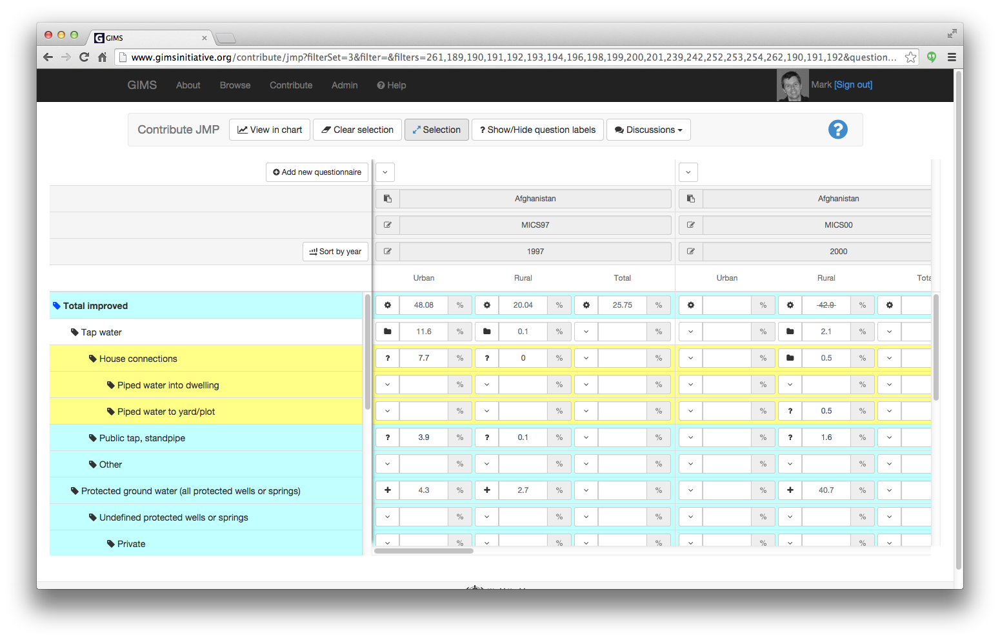
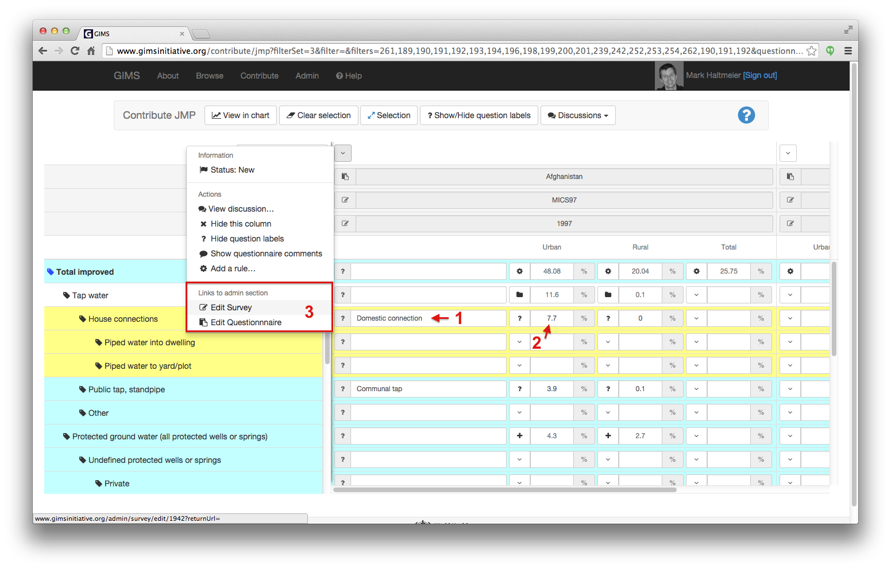
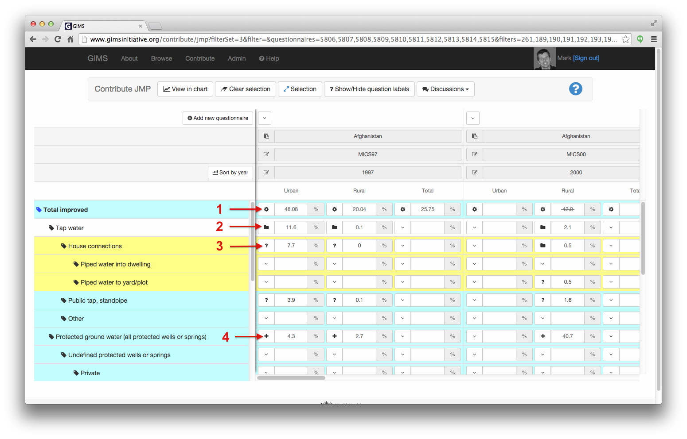
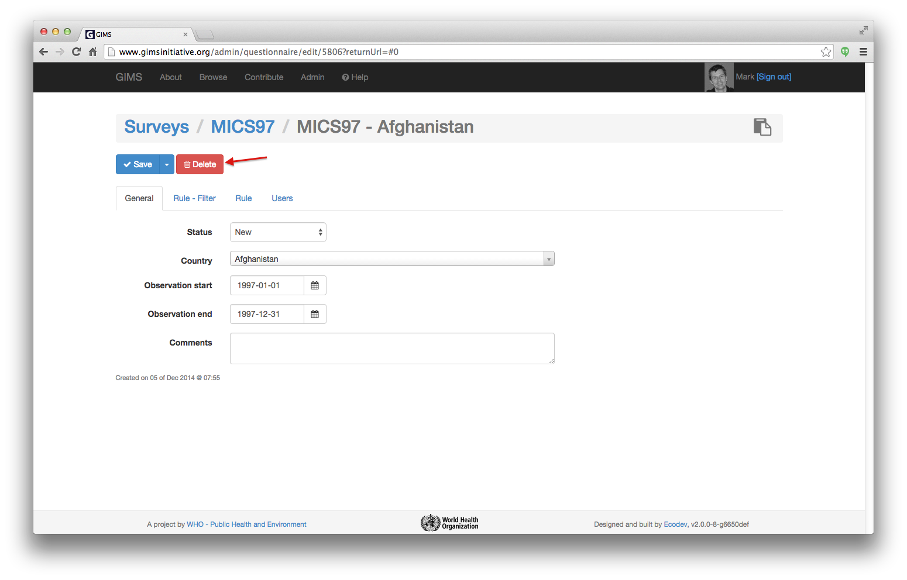
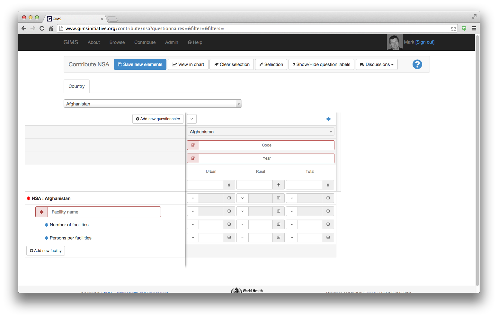
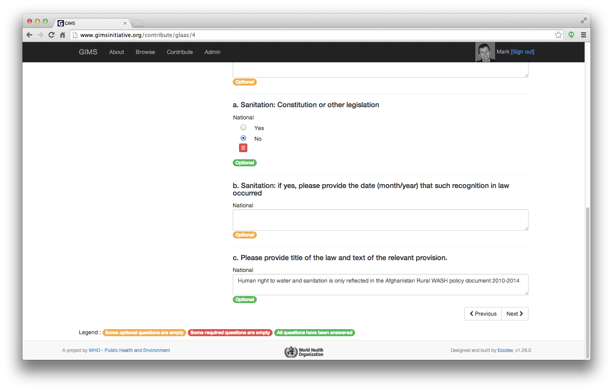

How to answer a questionnaire?
==============================

To be able to enter data into a questionnaire you must have the necessary access rights.

* If you already have a user account, simply sign in.

* If you don't have a user account yet, create one (see :ref:`sign-in`) and ask the author of the survey to provide you with the access rights (see :ref:`DI questionnaires users`).

Once you have signed in, go to the "Contribute" section.

.. image:: img/contribute.png
    :width: 100%
    :alt: Contribute section

On this page 3 specialized data entries are available:

#. :ref:`DI JMP` (WHO and UNICEF as well as National Statistics Offices)
#. :ref:`DI NSA` (National Sector Agency)
#. :ref:`DI GLAAS` (WHO)

.. _DI JMP:

JMP questionnaires
------------------

Once you have cliced on the "JMP questionnaires" button you will be directed to an interface that enables you to manage both *existing* data as well as *new info*.

.. image:: img/contribute_jmp1.png
    :width: 100%
    :alt: Edit JMP questionnaires

The typical flow will be to: 1) select your **country** in the "Questionnaires (columns) and 2) choose in the "Filter (rows) the **filter set** you need (ex. "water: use of improved sources (JMP data)). The resulting table looks very close to the former Excel country files.

.. note::

    The Questionnaires and Filter selection menus are automatically hidden once the table vue is generated. To access these menus again, simply click on the "Selection" button at the top.

.. note::

    This interface also enables you to select a Survey and get the corresponding questionnaires or via the "Selected" tab choose several questionnaires from different countries to display them side by side…

Actions can be performed at different levels. The first is the questionnaire. You can "Remove survey from table" (the equivalent of hiding the column in Excel).

.. image:: img/contribute_jmp3.png
    :width: 100%
    :alt: Edition tools for a JMP questionnaire

.. _DI edit JMP:

Edit a questionnaire
^^^^^^^^^^^^^^^^^^^^

If you have the access rights, you can edit the question labels (so called "original denomination" in the Excel country files), the survey comments as well as the survey and questionnaire.

Data that has a cogged wheel [1] results from a :term:`rule`, that you can override with a manually entered value: the symbol will then change to a question mark. If you erase the value you entered, the initial :term:`rule` will automatically apply again.

Data that has a question mark [2] has been entered manually and can be edited if needed.

.. warning::

    To avoid that unwanted modifications be performed to existing validated and published data, all existing questionnaires are "locked" (data in the cells with a grey background can't be edited). If modifications must really be made, you must first "Edit the questionnaire" and change the Status from "Published" to "New" [1]… and then click on "Save and close" [2]

.. image:: img/contribute_jmp6.png
    :width: 100%
    :alt: Change the status of a questionnaire

Back to the questionnaire, you can now modify existing values as well as add new data or delete existing info. Simply click in the cell, change the value and click somewhere outside the cell for it to update automatically.

.. _DI create new JMP questionnaire:

Add a new questionnaire
^^^^^^^^^^^^^^^^^^^^^^^

To add new data, simply click the "Add new questionnaire" button [1]. A new column is created. Select the country, enter an appropriate survey code and year and fill in the percentages. Once you have finished, click on the blue "Save new elements" button at the top.

.. image:: img/contribute_jmp7.png
    :width: 100%
    :alt: Add a new questionnaire

.. _DI delete a JMP questionnaire:

Delete a questionnaire
^^^^^^^^^^^^^^^^^^^^^^

To delete a questionnaire and it's linked answers, simply select "Edit questionnaire".

.. image:: img/contribute_jmp8.png
    :width: 100%
    :alt: Edit questionnaire

In the following administration panel, click on the red "Delete" button. A confirmation message appears, click again on "Delete".

.. warning::

    Once you delete a questionnaire, it is really erased as well as all the linked answers. There is no "undo" button !

.. _DI NSA:

NSA questionnaires
------------------

.. This section will have to be updated following change of workflow !

Once you have cliced on the "NSA questionnaire" button, you will be directed to an interface that enables you to manage both *existing* data (select NSA container) as well as *new info* (Create NSA container).

.. image:: img/contribute_nsa1.png
    :width: 100%
    :alt: Edit NSA questionnaires

The typical initial flow will be to: [1] "Create an NSA container" (i.e. filter set) by giving it a relevant name, typically "CountryName wat/san sector data".

Then [2] add one or several new questionnaires and [3] add one or several new equipments (facilities) for each questionnaire. Enter corresponding labels and numbers… for each part (urban, rural and total). Once the data has been entered, click on the blue "Save new elements" button at the top: the percentage are automatically calculated.

.. note::

    If your population numbers differ from the official statistics, you can enter under the "Population" cell [4] your own values.

.. image:: img/contribute_nsa3.png
    :width: 100%
    :alt: Add new questionnaires and equipments

If you return to update and/or enter new data, "Select the NSA container" you have already created as well as the country: the existing questionnaires will show up. You can edit the existing data, add new facilities as well as new questionnaires.

.. note::

    The current data flow and management will be greatly simplified in version 1.30 !

.. _DI GLAAS:

GLAAS questionnaires
--------------------

Once you have cliced on the button you will be directed to an interface that enables you to edit a given questionnaire.

Once in the questionnaire, navigation from one question to another can be done either by clicking on the menus on the left or using the “previous / next” buttons at the top and bottom of the page.

.. image:: img/contribute_glaas2.png
    :width: 100%
    :alt: Navigation within GLAAS questionnaires

Three colours are used to help users know which questions still need to be answered: red, orange and green (see the legend in the screen copy below). As soon as a question is answered, the colour changes. These colour codes are also made visible as dots to the left of each menu at all levels.

Example of a single choice question with two options = Boolean.

.. image:: img/contribute_glaas4.png
    :width: 100%
    :alt: GLAAS single choice question

Example of a single choice question with five options and for two parts (urban + rural).

.. image:: img/contribute_glaas5.png
    :width: 100%
    :alt: GLAAS single choice question

Example of a multi choice question.

.. image:: img/contribute_glaas6.png
    :width: 100%
    :alt: GLAAS single choice question

Example of a numerical and text question.

At any moment, the user can print [1] the questionnaire or export [2] the content as an Excel spreadsheet.

Once all the compulsory questions have been filled in, the user can submit the questionnaire for validation [3]. The button at the top changes colour according to the status. It will be:

* grey, if there are compulsory questions not yet answered
* orange, if there are optional questions not yet answered
* green, if all questions have been answered

Now that the data has been entered by a "reporter", the next step will be :doc:`data validation <data_validation>`.