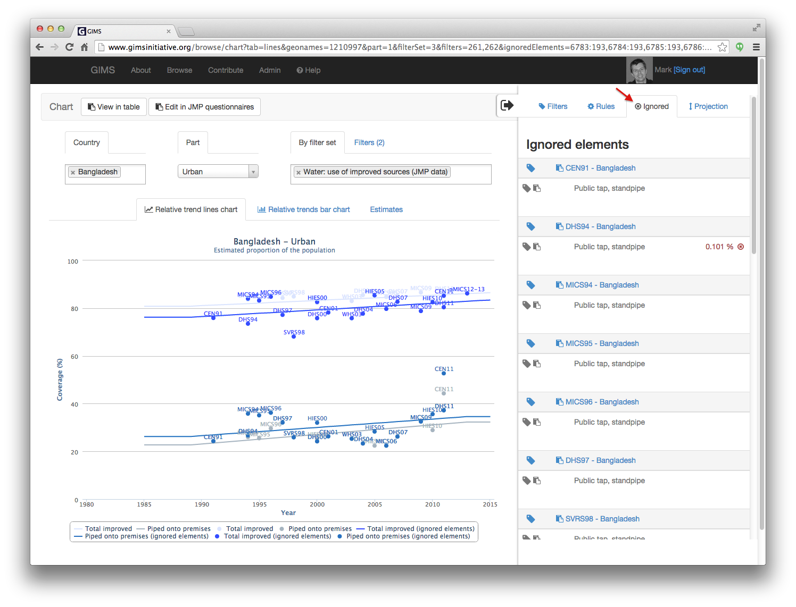
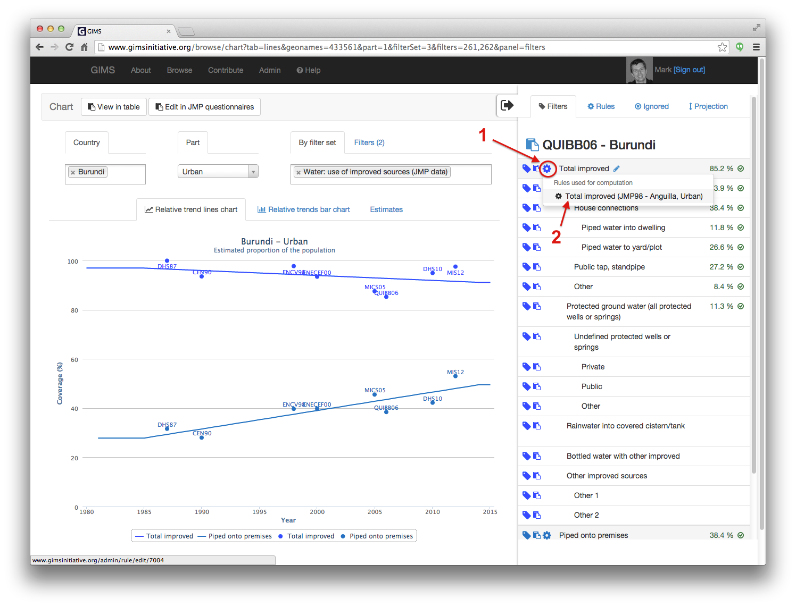

Data visualisation and analysis
===============================

Also GIMS has been built in such a way as to be able to handle numerous different data sets, the initial efforts have been focused on the processing of :term:`JMP` data as will be explained below in the :ref:`JMPgraphAnalysis`

Until the other interfaces are programmed, users can already use GIMS for the :doc:`data collection process <data_input>` and then **export** the answers in the form of Excel spreadsheets for further analysis. This can be done in two different places that correspond to different process stages:

* **Export questionnaire answers**: this is done from the Admin / Surveys where you can either "Export all questionnaires" (button at the top) or "Export selected" questionnaires (use the check boxes to select the countries). Data exported corresponds to the "raw", *non-processed* data.

.. image:: img/questionnaire_export.png
    :width: 100%
    :alt: Exporting questionnaire content

* **Export specific filtered data**: this can be done currently from the Browse / **Questionnaires** and **Countries** tables.

.. image:: img/browse.png
    :width: 100%
    :alt: Browse

In these tables, select the country(ies), :term:`filter set(s)<filter set>` (+ years) and once the content is visible, simply click on the "Export" button. The file you will obtain is already *processed* data through the :term:`filters<filter>` and their associated :term:`rules<rule>`.

.. note::

    The "Questionnaires table" provides an output of the filtered data per survey for the selected countries.

.. image:: img/data_export_questionnaire.png
    :width: 100%
    :alt: Exporting questionnaire filtered data

.. note::

    The "Countries table" provides an output of computed data, in absolute (a) and relative numbers, per year for the selected countries. The acronyms in the header of the table follow a simple logic: P = population; U = urban; R = rural; T = total; W = water; S= sanitation; I = improved; U = unimproved… (ex. WUTI = water urban total improved).

.. _JMPgraphAnalysis:

JMP graphs and graphical analysis
---------------------------------

To see how the water supply or sanitation facilities coverage evolve over time, trend lines are calculated based on a selection of data points. This interface is accessible via  Browse / Charts.

.. image:: img/browse.png
    :width: 100%
    :alt: Browse

Select a country, part (urban, rural or total) and filter set. The corresponding data points and trends lines are calculated and displayed. Pointing anywhere along the trend line provides a feedback regarding the corresponding coverage percentage.

Estimates can also be seen in the form of a table by clicking on the "Estimates" tab.

To get detailed information regarding a specific data point (questionnaire), you must simply click on the point. Since data points can overlap, you can zoom into the chart by drawing a rectangle over the area of interest (click and drag in diagonal).

Once you have zoomed in, you can select more easily the data point you are interested in [1].

.. note::

    To view again the entire graph, click on the "Reset the zoom" button [2].

.. image:: img/chart_zoomed.png
    :width: 100%
    :alt: Zoom of the chart

The panel on the right opens up and displays detailed information pertaining to this data point. The first tab (Filters) shows the details of what makes up this data point.

.. _DP graphical analysis:

Graphical analysis
^^^^^^^^^^^^^^^^^^

To see the impact of ignoring a specific filter either just for the current questionnaire [1] or for all questionnaires displayed [2], click on the corresponding icon. The data points (questionnaires) are recalculated without this filter element and a new trend line calculated and drawn. The initial data points are now in a lighter shade of the initial colour and the trend lines are dashed (as shown in the legend). Furthermore, the percentage ignored is highlighted in red [3] and the (sub)total(s) adjusted accordingly [4]. It is possible to ignore several elements by simply clicking on the appropriate icons of the filter elements you wish to ignore.

.. note::

    By clicking on the labels in the legend, you can hide elements you don't want to display on the graph.

The ignored data can be seen in the "Ignored" tab and reintegrated by simply clicking on the appropriate icon.

It is also possible to ignore an entire questionnaire by clicking on the icon to the left of the questionnaire code [1]. The data point of the questionnaire is shaded on the chart as well as the label in the panel and the trend line recalculated accordingly. To reintegrating a questionnaire, click again on the same icon.

Certain data points of a given filter are either entirely of partly the result of calculations. This is shown by the presence of the cogged-wheel icon [1].

.. note::

    Details of the calculations will be made available soon. In the mean time, the list of all the calculations, ratios and estimates used at some stage can be found in the "Rules" tab [2].

For further analysis, see the :doc:`JMP data reconciliation process <data_reconciliation>`.