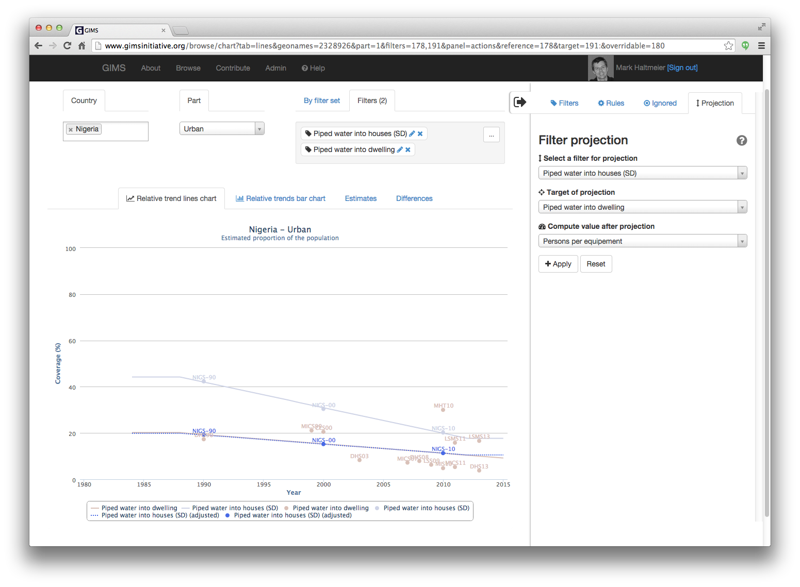

JMP data reconciliation process
===============================

Provider-based and user-based monitoring approaches measure different, yet complementary, things:

* *outputs* (what infrastructure is available to the population) is typically measured by the :term:`NSA`. Numerous countries are developing Sector Information Management Systems (SIMS) to this effect.
* *outcomes* (what infrastructure people are actually using) is measured by the :term:`NSO` and other organisations via household surveys and censuses. This information makes up the basic and historical corpus of the :term:`JMP` which is now managed within GIMS.

GIMS enables to handle these two approaches and compare results so as to identify existing problems that can be related to different definitions of improved facilities, different methodologies for estimating coverage, or different definitions of urban/rural.

Editing and comparing JMP and NSO data
--------------------------------------

NSO and JMP data may differ due to different definitions of what is considered improved / unimproved both for water and sanitation.

NSO users can visualize the impact of such modifications via the Browse / Charts section by ignoring certain filters and/or questionnaires and seeing the impact of this adaptation on the calculated trend line.

.. image:: img/data_reconciliation1.png
    :width: 100%
    :alt: Data reconciliation process

If they want to add one or several data sets, they can do so via the :ref:`DI create new JMP questionnaire` or the :ref:`DI JMP` section.

.. note::

    A direct link from the Chart will be added soon to facilitate this creation.

.. warning::

    These new questionnaires will only be visible to their author and the users to whom he will give the access rights !
    
.. note::
    
    If JMP staff decides to integrate this new data set into the officially approved data, they can do so by changing the status of the questionnaire from "new" to "published".

Having added one or several new datasets; ignored certain filters and eventually also certain questionnaires, the resulting trend line will provide the result for the National Statistics Office (NSO) [1]. The difference with the original JMP data points and trend line (in shaded color and dashed line) [2] are clearly visible.

.. note::

    If you wish to share your graph with someone else, simply copy the URL [3] and send it to him.

.. image:: img/data_reconciliation2.png
    :width: 100%
    :alt: Data reconciliation process

Editing and comparing JMP/NSO and NSA data
------------------------------------------

JMP/NSO data will most certainly differ from :term:`NSA` data. One important reason is that the estimated number of persons having access to the facilities according to NSA data often doesn't match with effective use (i.e. what JMP/NSO measure).

To add NSA sector data, simply clic on the "Create sector dataset" button.

.. image:: img/data_reconciliation3.png
    :width: 100%
    :alt: NSA data entry

Go to the :ref:`DI NSA` to review how to enter new NSA data.

Once the NSA sector data has been created…

.. image:: img/data_reconciliation4.png
    :width: 100%
    :alt: NSA data entry

…you can display it on the graph by simply adding the corresponding filter set to the existing one. The difference between NSO (blue) and NSA (purple) data is clearly visible.

To estimate by how many users per equipment one should lower current estimates (50 for equipment 1 and 100 for equipment 2 in the example above), clic on the "Actions" tab.

Here you will have to select 3 parameters to be used:

* **Filter for the projection**: select the trend line you wish to move. In the example below "Improved equipment 1" has been chosen.
* **Target of projection**: select the trend line you wish to match. In the example below "Total improved (ignored elements)" has been chosen since this corresponds to the NSO data.
* **Compute value after projection**: select the parameter that should be calculated, typically the number of people per equipment.

.. image:: img/data_reconciliation7.png
    :width: 100%
    :alt: Actions tab for graphical data reconciliation

Clic on the "Apply" button. The initial blue trend line drops (here in red) to match the NSO purple line.

.. image:: img/data_reconciliation8.png
    :width: 100%
    :alt: Actions tab for graphical data reconciliation

Clic on the Estimates tab to discover by how many persons per equipment the number should be updated.

.. image:: img/data_reconciliation9.png
    :width: 100%
    :alt: Calculated difference in Estimates tab