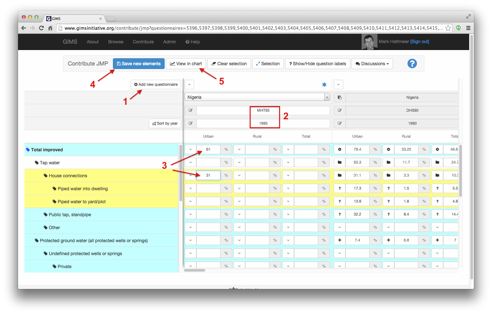
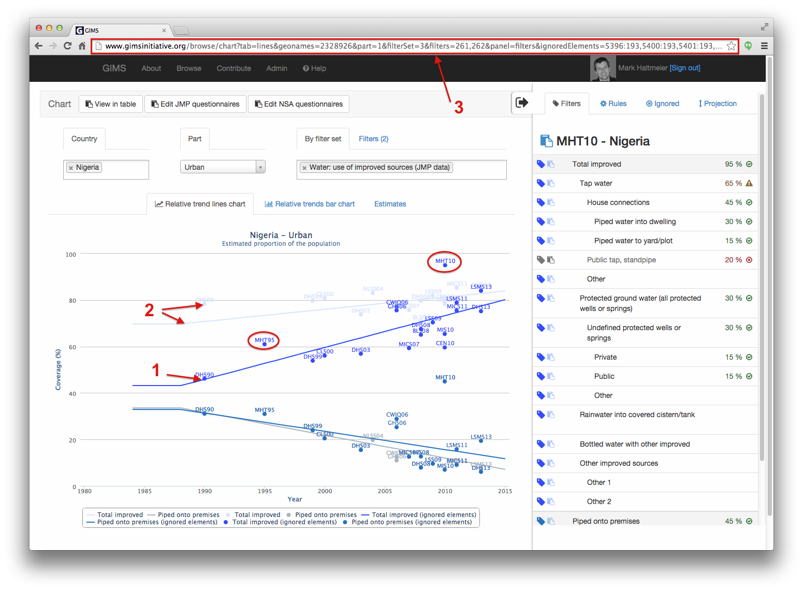
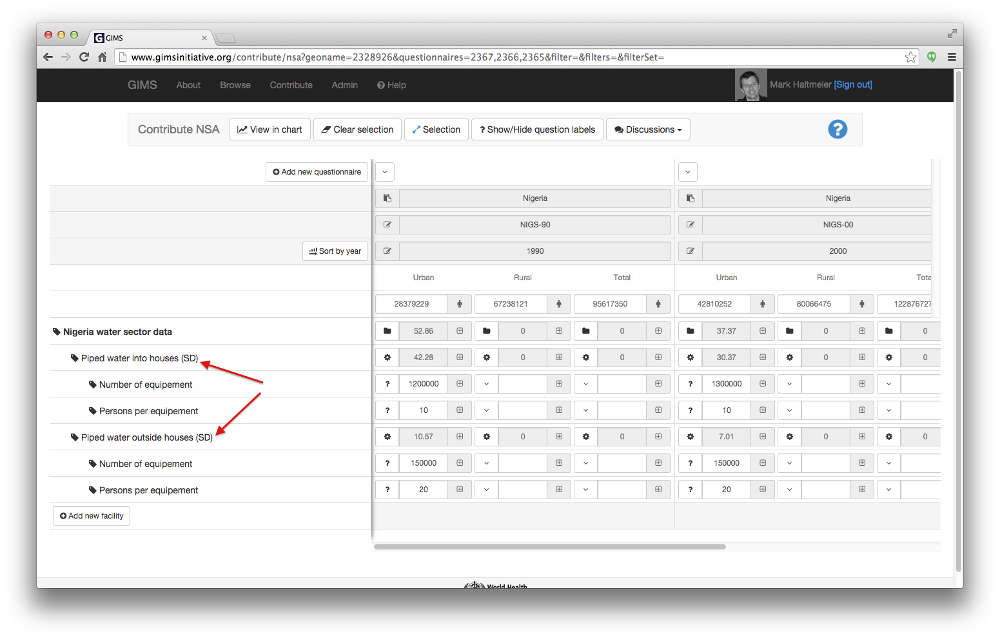

JMP data reconciliation process
===============================

*Provider-based* and *user-based* monitoring approaches measure different,
yet complementary, things:

* *outputs* (what infrastructures are available to the population) is
  typically measured by the :term:`NSA`. Numerous countries are developing
  Sector Information Management Systems (SIMS) to this effect.
* *outcomes* (what infrastructures people are actually using) is measured by the
  :term:`NSO` and other organisations via household surveys and censuses. This
  information makes up the basic and historical corpus of the :term:`JMP`
  which is now managed within GIMS.

GIMS enables to handle these two approaches and compare results so as to
identify existing problems that can be related to different definitions
of improved facilities, different methodologies for estimating coverage,
or different definitions of urban/rural, etc.

Editing and comparing JMP and NSO data
--------------------------------------

Also NSO and JMP both measure *outcomes*, data may differ due to different definitions of what is considered improved / unimproved both for water and sanitation.

NSO users can visualize the impact of such modifications via the Browse /
Charts section by ignoring certain filters and/or questionnaires and seeing
the impact of this adaptation on the calculated trend line. In the example below, data under "Public tap, standpipe" has been ignored for all questionnaires (see the :ref:`JMPgraphAnalysis` section for basic notions).

NSO users can easily add one or several data sets, if needed, via the "Actions" tab [1] and clicking on "All filters" [2].

.. image:: img/data_reconciliation1a.png
    :width: 100%
    :alt: Editing data in tables

.. warning::

    These new questionnaires will only be visible to their author and the
    users to whom he will give the access rights (see how to give access rights to :doc:`user`)!

By default, the filters shown will correspond to the top level ones displayed on the chart, which might be sufficient if the person only wants to enter a coverage total to see it's impact on the calculated trend line. Click on "Add new questionnaire" [1], enter the data [2], Save new elements [3] and the click on the "Back" button [4] to view the updated chart.

If the user would like to enter more detailed data, he can simply add the filter's children by [1] clicking on the selection button and then choosing the desired filter [2].

.. image:: img/data_reconciliation1c.png
    :width: 100%
    :alt: Expanding the filters displayed

.. note::

    If JMP staff decides to integrate this new data set into the officially
    approved data, they can do so by changing the status of the questionnaire
    from "new" to "published".

Having added one or several new datasets (in the example below "DAT10"); ignored certain filters and eventually also certain questionnaires, the resulting data points and trend line will provide the National Statistics Office's version [1]. The difference with the original JMP data points and trend line (in shaded color and dashed line) [2] are clearly visible.

.. note::

    If you wish to share your graph with someone else, simply copy the URL
    [3] and send it to him.

Editing and comparing JMP/NSO and NSA data
------------------------------------------

JMP/NSO data will most certainly differ from :term:`NSA` data. One important
reason is that the estimated number of persons having access to the facilities
according to NSA data often doesn't match with effective use (i.e. what
JMP/NSO measure).

To add NSA sector data, simply click on the "Create sector dataset" button.

.. image:: img/data_reconciliation3.png
    :width: 100%
    :alt: NSA data entry

.. note::

    To review how to edit NSA data, see the :ref:`DI NSA` section.

In the example below, we assume NSA have detailed data regarding piped water into and outside houses, the later being equivalent to the "piped water to yard/plot" filter.

.. note::

    For these sector data equipments, we recommend you append "SD" to the equipment label so as to distinguish easily NSA data in the chart.

Once the NSA sector data has been created, you can display it on the graph so as to compare data points and corresponding trends lines with official JMP values.

To ensure the comparisons performed are meaningful, it is best that you only display equivalent filters [1]. In the example below, we have displayed the JMP filter "Piped water into dwelling" (in blue) and the sector data "Piped water into houses (SD)" (in red).

To discover by how many persons per equipment the NSA estimations need to be corrected, click on the "Actions" tab [2] and select the parameters to be used:

* **Filter for the projection** [3]: select the trend line you wish to move. In
  the example below the NSA data (red line)
* **Target of projection** [4]: select the trend line you wish to match. In our
  example the JMP data (blue line)
* **Compute value after projection** [5]: select the parameter that should be
  calculated, typically the number of persons per equipment.

Click on the "Apply" button [6].

.. image:: img/data_reconciliation5.png
    :width: 100%
    :alt: Comparable JMP and NSA data plotted

The NSA trend line drops down in our example to adjust to the JMP data.

.. image:: img/data_reconciliation6.png
    :width: 100%
    :alt: Trend line adjustement

To discover by how many persons the estimation should be adjusted, click on the "Differences" tab [1]. In our example, we see that the initial NSA estimation of 10 persons per equipment is close to the double of effective numbers (between 5-6 persons).

.. note::

    GIMS will soon enable users to perform even more precise estimations by integrating a "quality" parameter that measures the percentage of equipments that are not operational anymore…