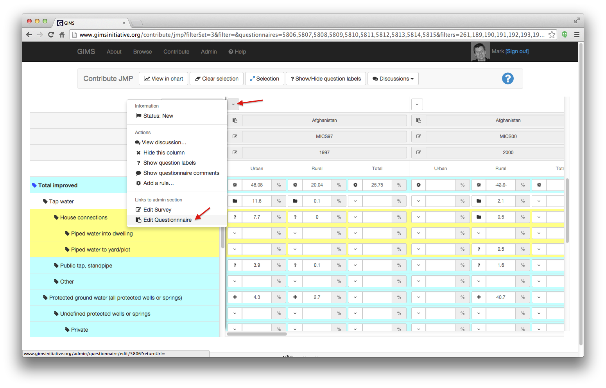

Data validation
===============

The standard data flow goes as follows with the corresponding status of
the questionnaire:

* **new**: initial status required to enter / edit data. This is normally
  done by a :term:`reporter`.
* **completed**: the reporter has finished entering the information and
  is requesting the questionnaire be validated. The person assigned as
  :term:`validator` is automatically notified by email. From this stage on,
  the data can't be modified anymore unless the validator reverts the status
  back to "new".
* **validated**: this status is given to a questionnaire once it has been
  reviewed and the content considered validated. Data can't be edited anymore
  (unless reverted back to "New"), but is not yet published.
* **published**: this status is required for the data to be accessible to
  everyone via the browse section of GIMS. This step can only be performed by a
  limited number of "super-admin" users that have a :ref:`Questionnaire publisher <special_roles>` role.
* **rejected**: this status is a way of "archiving" data that one doesn't
  want to render visible or take into consideration in calculations, but that
  is kept for historical reasons (a way of knowing this data has been seen
  but that one has decided not to use it).

.. _change questionnaire status:

How to change de status of a questionnaire?
-------------------------------------------

If your have the necessary access rights, you can change the status of a
questionnaire directly from the Contribute / questionnaires view by clicking on
the "Edit Questionnaire".

In the following administration panel, click on the "Status" drop-down menu
and perform the necessary modification.

.. warning::

    If you decide to revert a published questionnaire to "new" so as to be
    able to edit it's content, don't forget to set it back to the "published"
    status once you have finished performing the desired modifications !

It is also possible to edit the survey via
:menuselection:`Admin --> Surveys --> Survey --> Questionnaire`…

.. note::

    Need further help? Send an email to who@gimsinitiative.org