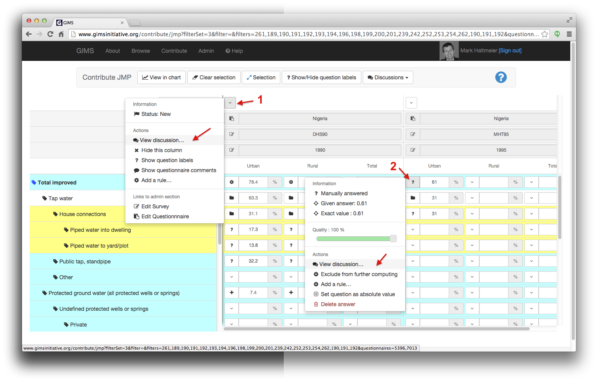
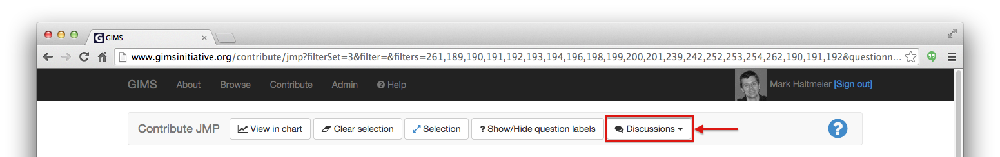
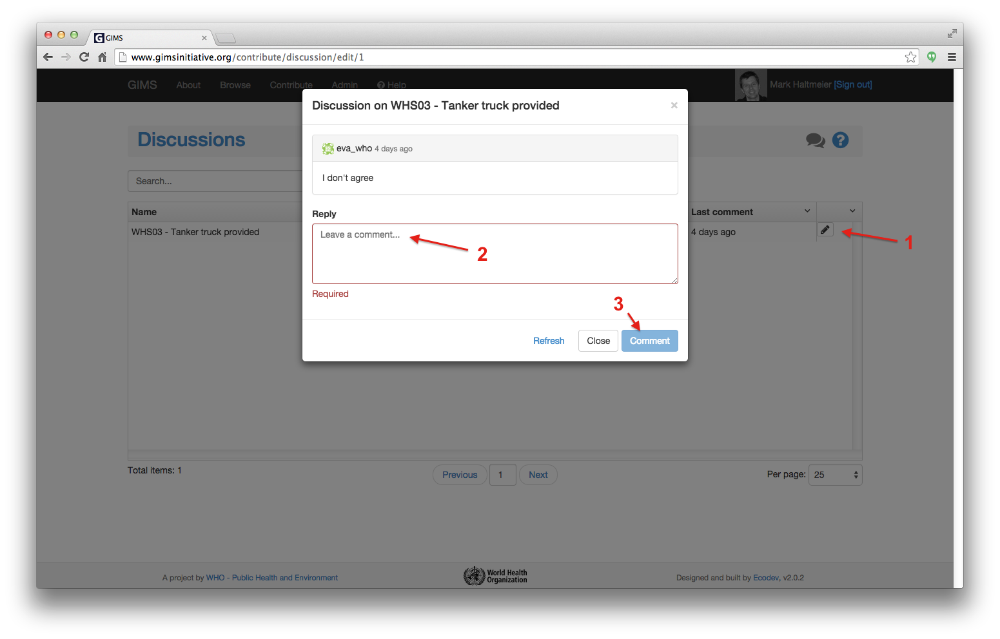

Discussion
==========

Discussions are a way for multiple users to share feedbacks and opinions.

All discussions are publicly available to anyone, but only registered users can
participate.

Creation
--------

A discussion can be related to different things (topic). Currently, a single
discussion can be attached to one of the following:

* :term:`survey`
* :term:`questionnaire` [1]
* :term:`questionnaire` - :term:`filter` [2] (representing a value in JMP table)

On JMP tables an entry in the contextual menus allows the user to seamlessly
create a new discussion, or view an existing one.

Reading & commenting
--------------------

Discussions currently available on the JMP table are listed under the
:guilabel:`Discussions` button. Discussions listed there are dependent on
questionnaires and filters currently selected.

More globally, a discussion can also be reached via
:menuselection:`Contribute --> Discussions`. There, all existing discussions
are listed and are searchable by topic. To view the comments and participate
click on the pencil icon [1], enter your comment [2] and click on the blue
:guilabel:`Comment` button.

