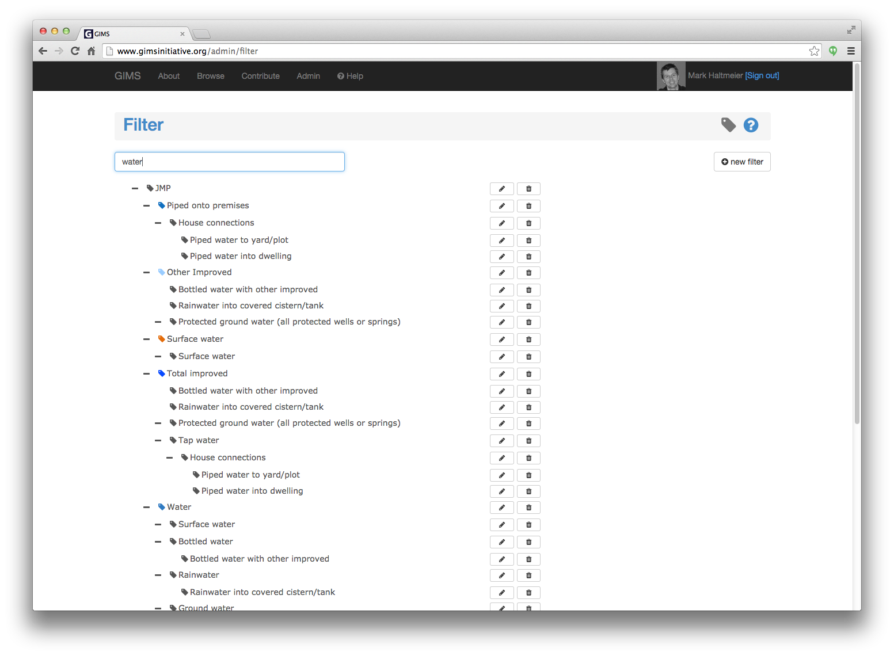
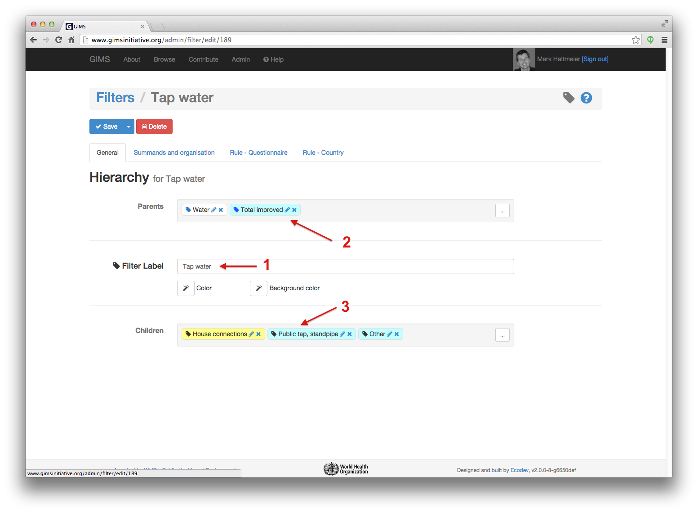
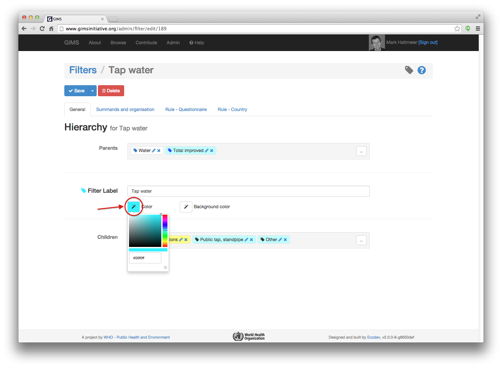
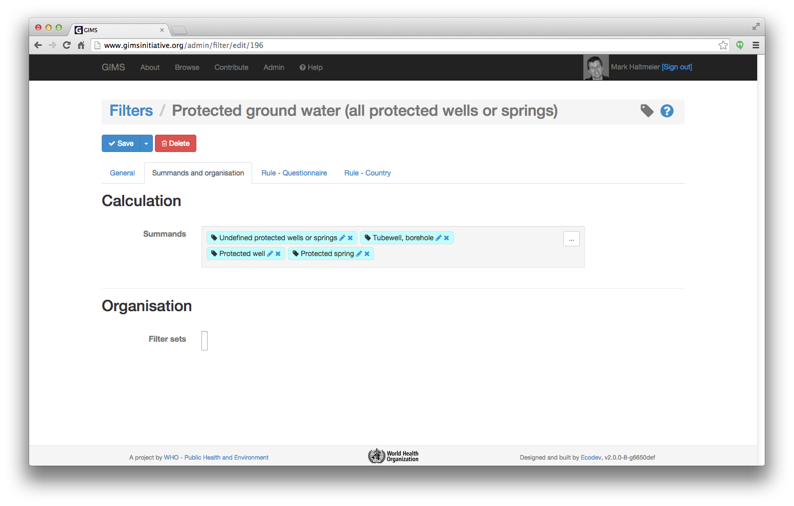

Filters
=======

Filters enable you to categorize and organize information.

To edit or create a filter, go to the Administration section and click on the
"Filter" icon.

.. image:: img/administration.png
    :width: 100%
    :alt: Admin section

The list of filters provides at a first glance how filters have been
encapsulated in each other: most filters being child elements of other parent
filters. This hierarchy can theoretically be infinite.

Click in the search bar and start typing the name of the filter you wish
to edit: the list will progressively reduce itself, thus facilitating the
research.

The filter label [1] will position itself between it's eventual parent filters,
above [2] and child filters, below [3].

If you wish to change the color of the filter used in the graph, click on
the color selection icon. If changes have been performed and you want to
keep them, don't forget to click on the blue :guilabel:`Save` button.

.. _Summands:

Summands
^^^^^^^^

If in most cases the filter structure provides a logical view of how elements add-up (a parent is typically the sum of it's children), some filters can be the sum of several other filters dispatched within the filter tree. Such calculations are defined in the "Summands" field by simply inserting the filter elements you wish to add-up.

.. note::

    You can directly edit parent and/or child filters by clicking on the
    pencil to the right of their label.

The **Rule - Questionnaire** and the **Rule - Country** tabs contain the
list of rules linked to this filter in different questionnaires.
