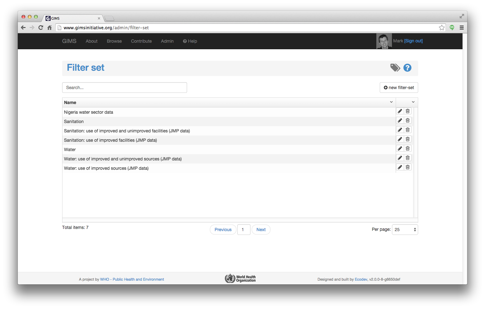
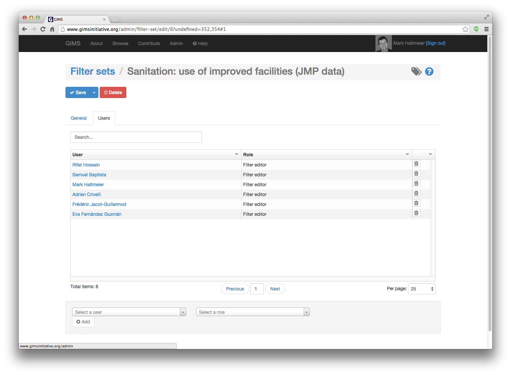

Filter sets
===========

Filter sets can be seen as "folders" that facilitate the selection of a group of :term:`filer(s)` .

To edit or create a filter set, go to the Administration section and clic on the "Filter sets" icon.

.. image:: img/administration.png
    :width: 100%
    :alt: Admin section

Normally the list shouldn't be very long. You will see both "official" JMP water and sanitation filter sets as well as the eventual filter sets you have created.

If the list is too long, start typing the name of the filter set in the search bar. Once it appears in the list, clic on the pencil icon to edit the record.

The **General** tab contains the label of the filter set as well as it's child filters. These can be directly edited by clicking on the pencil icon.

.. image:: img/filterset2.png
    :width: 100%
    :alt: edit a filter set

The **Users** tab contains the list of people that can modify this filter set. For filter sets you have created in other places of the system, you are by default the only user. You can add other people if you wish.

