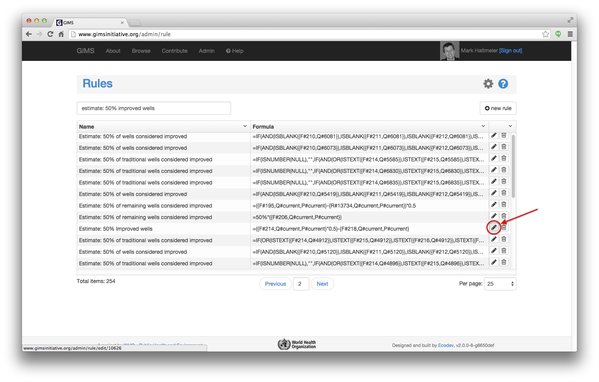
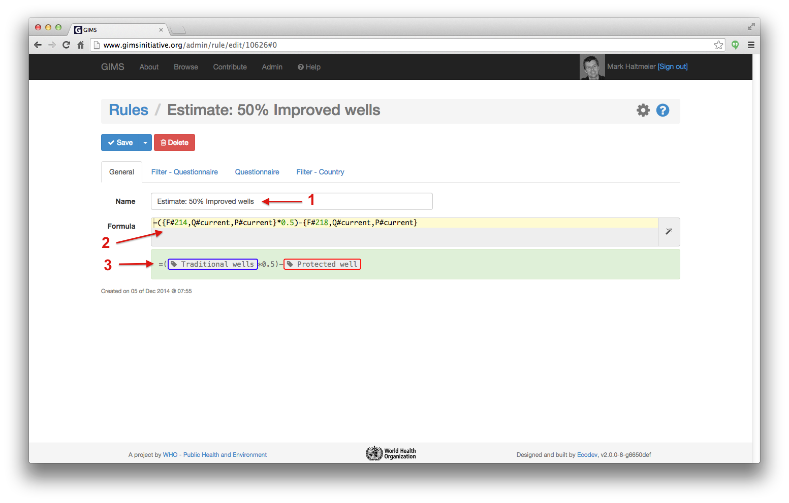

Rule
====

Rules provide a way to define custom calculation during the
:doc:`computing process<computing>`. One rule is defined by its
formula and can be shared in many places. Rules can be used in three different
ways:

#. On a :term:`filter` - :term:`questionnaire` - :term:`part` triplet
#. On a :term:`questionnaire` - :term:`part` pair
#. On a :term:`filter` - :term:`geoname` - :term:`part` triplet

This first application can be used to *override an answer*. For instance if the
answer should not be computed the usual way, then we can customize it to be
anything we want.

The second application is used to compute any arbitrary values within a
questionnaire. Typical usage would be to compute Calculations,
Estimations and Ratios as done in former Excel country files.

Finally, the third application is used much later, after the
:ref:`regression step <step4>`. This can be used to define that values should
not be higher than 100%. Conceptually it could be something like: ``Other
Unimproved`` =
``100% - Total improved - Surface water``.

.. note::

    While final results are displayed as percentages between 0 and 100,
    internally
    they are always computed between 0.00 and 1.00. Therefore formulas must
    be written
    to work between 0.00 and 1.00. The recommended way to do that, to avoid any
    possible confusion, is to explicitly use the `%` symbol. For example:

        .. code-block:: lua

            =12.5% + 8%

Formula syntax
--------------

The formula syntax is based on the one used in Excel, except that cell
references (eg: ``A2``,
``B3``) must be entirely replaced with GIMS specific syntax. The basic
structure
of GIMS syntax is enclosed in ``{}``. Within those delimiters are references to
various GIMS objects, according to the possibilities described below. Finally,
as seen above, there are two distinct contexts whose syntaxes cannot be mixed.
The first context is before the regression, and the second context is
after the regression.

.. _step:

Where:

* ``F`` = :term:`Filter`
* ``Q`` = :term:`Questionnaire`
* ``P`` = :term:`Part`
* ``R`` = :term:`Rule`
* ``S`` = Step, only two possibilities: absent, so only rules of Step 1 will be
  used, or exactly "S#2" to indicate that rules of Step 2 should also be used
  (:ref:`see explanation <step2>`)
* ``Y`` = Year offset

.. _current:

``F``, ``Q`` and ``P``, can have the value ``current`` instead of a specific
ID. ``current`` refers to the context where the rule is applied. If a rule is applied on
the filter "Total improved" then the current filter will be evaluated as "Total improved".
And if the same rule is also applied to "Piped onto premises", then the current
filter will be evaluated as "Piped onto premises" for that application. While
optional, the usage of ``current`` allows to share a single rule for multiple
applications, so it should be favored as much as possible.

Before regression context
^^^^^^^^^^^^^^^^^^^^^^^^^

**Filter value**
    Reference a filter value.

    .. code-block:: lua

        {F#12,Q#34,P#56}
        {F#12,Q#34,P#56,S#2}

**Question label**
    Reference a question label. If the question has no answer, it will return
    ``NULL``. When used with ``ISTEXT()``, it can be used to detect if an
    answer exists.

    .. code-block:: lua

        {F#12,Q#34}

**Rule value** (Calculations/Estimations/Ratios)
    Reference a rule value. Typically used to reference a Calculation,
    Estimation or Ratio.

    .. code-block:: lua

        {R#12,Q#34,P#56}

    .. warning::

        The referenced rule must exist and be applied to the specified
        questionnaire and part, otherwise computation will fail. To avoid
        possible trouble, it is recommended to use the syntax wizard.

**Population value**
    Reference the population data of the questionnaire\'s country. This is an
    absolute value expressed in number of persons.

    .. code-block:: lua

        {Q#34,P#56}

After regression context
^^^^^^^^^^^^^^^^^^^^^^^^

**Cumulated population**
    Reference the cumulated population for all current questionnaires for the
    specified part.

    .. code-block:: lua

        {Q#all,P#56}

**Current year**
    Reference the year we are currently computing. This may be useful for very
    exceptional edge cases, but should be avoided as much as possible.

    .. code-block:: lua

        {Y}

Both contexts
^^^^^^^^^^^^^

**List of all filter values**
    Reference a list of available filter values for all questionnaires. The
    result use Excel array constant syntax (eg: "{1,2,3}"). This should be used
    with Excel functions such as ``COUNT()`` and ``AVERAGE()``.

    .. code-block:: lua

        {F#12,Q#all}

**Filter value after regression**
    Reference a Filter regression value for a specific part and year. By default
    the year is the one currently computed (in before regression context: the
    questionnaire's
    year, and in after regression context: the current year as returned by ``{Y}``).
    However it is possible to define an offset from that year. To express "1 year
    earlier" the offset would be -1, and for "3 years later", it would be +3. To
    stay on the same year, use an offset of 0.

    .. code-block:: lua

        {F#12,P#current,Y0}
        {F#12,P#current,Y-1}
        {F#12,P#current,Y+3}

**Value if this rule is ignored**
    Reference the value if computed without this rule. It allows to
    conditionally
    apply a rule with syntaxes such as ``IF(can_apply_my_rule,
    compute_some_result, {self})``.

    .. code-block:: lua

        {self}

Examples
^^^^^^^^

An entire formula could be:

.. code-block:: lua

    =IF(ISTEXT({F#12,Q#34}), SUM({F#12,Q#34,P#56}, {R#2,Q#34,P#56}),
    {R#2,Q#34,P#56})

Or the more re-usable version:

.. code-block:: lua

    =IF(ISTEXT({F#12,Q#current}), SUM({F#12,Q#current,P#current},
    {R#2,Q#current,P#current}), {R#2,Q#current,P#current})

.. _rule-edition:

Edit and create a rule
----------------------

To edit or create a rule, go to the Administration section and click on the
"Rules" icon.

.. image:: img/administration.png
    :width: 100%
    :alt: Admin section

Filter the list of rules by using the search field and click on the pencil icon to edit it.

The name of a rule should be as explicit as possible [1]. The formula [2] that can be edited is "translated" into a more comprehensible form below [3].

.. note::

    Need further help? Send an email to who@gimsinitiative.org
