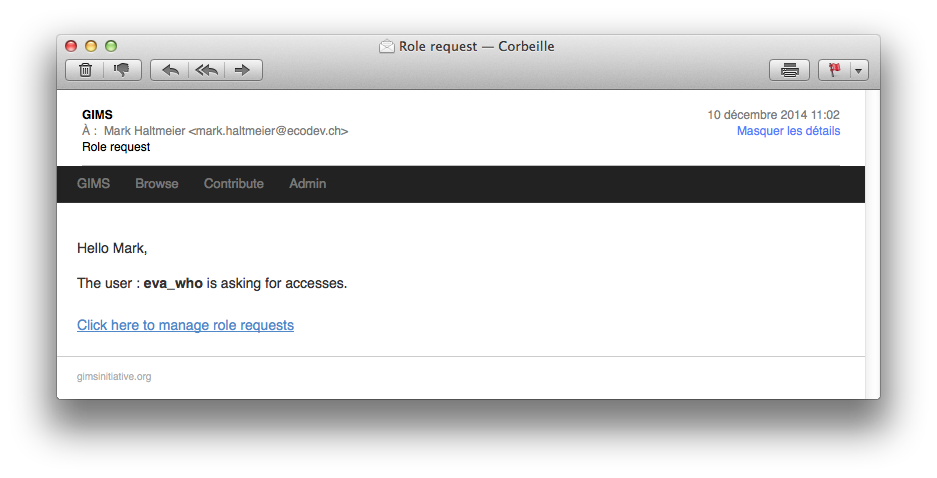
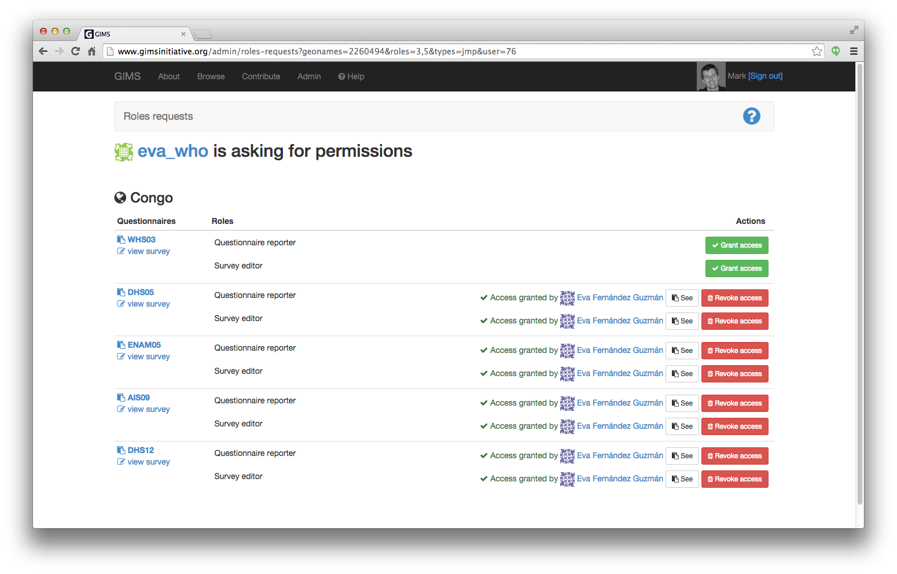

Users
=====

Access rights to all the data within GIMS is given to users.

Each user who has an active account can conduct his own :term:`survey`. He can
then decide with whom he will collaborate and share the information gathered.

To edit a user account, go to the Administration section and click on the
"Users" icon.

.. image:: img/administration.png
    :width: 100%
    :alt: Admin section

To find the user, start typing the name in the search bar. Once the person
appears in the list, click on the pencil icon to edit the record.

.. image:: img/user1.png
    :width: 100%
    :alt: search for a user

The **General** tab contains basic contact and function information.

.. image:: img/user2.png
    :width: 100%
    :alt: User account general info

.. _user-roles:

In the **Surveys**, **Questionnaires** and **Filter sets** tabs you can see
which data the user can access and with which access rights. To grant the user access to extra surveys, questionnaires and filter sets you must select the item [1] and define his role [2].

.. image:: img/user3.png
    :width: 100%
    :alt: User account general info

.. _permissions:

Granting permissions
-------------------

When a user performs a permissions request, the owner(s) of the data set receive an email.

By clicking on the link in the email, the owner is directed to a page where he can see what is being requested and grant the access by clicking on the corresponding "Grant access" button.
He can also revoke an access that has been granted, if necessary…

.. note::

    Need further help? Send an email to who@gimsinitiative.org

.. add info about how to add a "viewer" role to enable other people to see new questionnaires you have added (when implemented)…