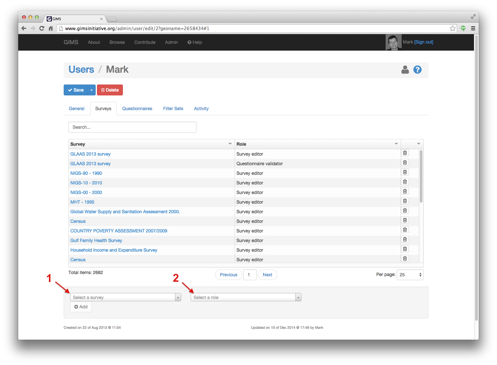

Users
=====

Access rights to all the data within GIMS is given to users.

Each user who has an active account can conduct his own :term:`survey`. He can then decide with whom he will collaborate and share the information gathered.

To edit a user account, go to the Administration section and click on the "Users" icon.

.. image:: img/administration.png
    :width: 100%
    :alt: Admin section

To find the user, start typing the name in the search bar. Once the person appears in the list, click on the pencil icon to edit the record.

.. image:: img/user1.png
    :width: 100%
    :alt: search for a user

The **General** tab contains basic contact and function information.

.. image:: img/user2.png
    :width: 100%
    :alt: User account general info

In the **Surveys**, **Questionnaires** and **Filter sets** tabs you can see which data the user can access and with which access rights as well as give the user access to extra surveys, questionnaires, etc.

